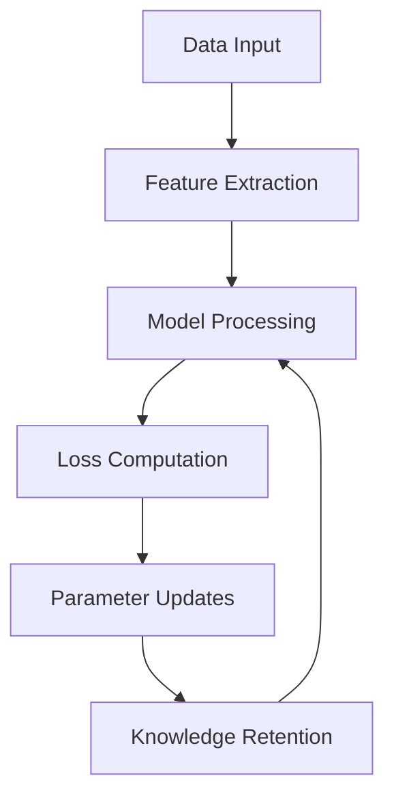

# AI Models as Living Systems

This document explores how AI/ML models and their training processes mirror natural ecosystems and embody our ethos of responsible, sustainable AI development.

## Core Parallels

### 1. Model Evolution & Natural Selection

Like biological evolution, our models evolve through:

```yaml
Training Cycles:
- Parameter optimization
- Architecture refinement
- Feature selection
- Performance adaptation

Selection Pressures:
- Accuracy metrics
- Resource efficiency
- Inference speed
- Memory usage
```

### 2. Energy Flow in Training

Training processes mirror ecological energy flows:



### 3. Symbiotic Relationships

Models exist in symbiotic relationships:

```yaml
Model Interactions:
- Teacher-Student Knowledge Transfer
- Ensemble Collaboration
- Multi-Model Fusion
- Transfer Learning

Resource Sharing:
- GPU Memory
- Compute Cycles
- Training Data
- Feature Extractors
```

## Implementation Principles

### 1. Sustainable Training

Like sustainable ecosystems:

```yaml
Resource Management:
- Gradient accumulation
- Mixed precision training
- Dynamic batch sizing
- Memory optimization

Energy Efficiency:
- Model pruning
- Knowledge distillation
- Architecture optimization
- Selective fine-tuning
```

### 2. Adaptive Learning

Models adapt like living organisms:

```yaml
Adaptation Mechanisms:
- Learning rate scheduling
- Dynamic architecture
- Active learning
- Online adaptation

Environmental Response:
- Data distribution shifts
- Resource availability
- Task complexity
- Performance requirements
```

### 3. Knowledge Ecosystems

Creating interconnected knowledge systems:

```yaml
Knowledge Flow:
- Pre-training → Fine-tuning
- Base models → Specialized variants
- Research → Production
- Feedback → Improvement

Knowledge Preservation:
- Checkpointing
- Version control
- Model registries
- Architecture documentation
```

## Practical Applications

### 1. Training Workflow

Training mirrors natural growth cycles:

```yaml
Development Stages:
1. Seed (Initial Architecture)
2. Germination (Pre-training)
3. Growth (Fine-tuning)
4. Maturation (Optimization)
5. Reproduction (Deployment)
6. Evolution (Continuous Learning)
```

### 2. Resource Utilization

Efficient resource use like natural systems:

```yaml
GPU Utilization:
- H100s: Complex training
- A100s: Inference/fine-tuning
- Dynamic allocation
- Load balancing

Memory Hierarchy:
- GPU Memory (Fast/Limited)
- System Memory (Medium/Larger)
- Disk Storage (Slow/Vast)
```

### 3. Model Lifecycle

Natural lifecycle management:


## Ethical Considerations

### 1. Responsible Growth

Like sustainable ecosystems:

```yaml
Growth Principles:
- Resource efficiency
- Minimal environmental impact
- Sustainable scaling
- Ethical considerations

Development Guidelines:
- Bias mitigation
- Fairness metrics
- Transparency
- Accountability
```

### 2. Balanced Development

Maintaining ecosystem balance:

```yaml
Balance Factors:
- Performance vs. Efficiency
- Speed vs. Accuracy
- Complexity vs. Interpretability
- Innovation vs. Stability
```

## Future Directions

### 1. Self-Evolving Systems

Moving toward autonomous evolution:

```yaml
Autonomous Capabilities:
- Architecture search
- Hyperparameter optimization
- Resource allocation
- Performance optimization

Evolutionary Mechanisms:
- Neural architecture evolution
- Dynamic capacity adjustment
- Adaptive learning strategies
- Self-optimization
```

### 2. Ecosystem Integration

Deeper integration with infrastructure:

```yaml
Integration Points:
- Automated deployment
- Resource optimization
- Performance monitoring
- Continuous improvement

Feedback Loops:
- Usage patterns
- Error analysis
- Resource utilization
- Performance metrics
```

## Conclusion

By treating our AI models as living systems within a larger ecosystem, we:

1. **Optimize** resource utilization
2. **Enhance** model performance
3. **Ensure** sustainable growth
4. **Maintain** ethical alignment
5. **Enable** continuous evolution

This approach creates a harmonious balance between technical capability and responsible development, reflecting our ethos in every aspect of our AI systems.
