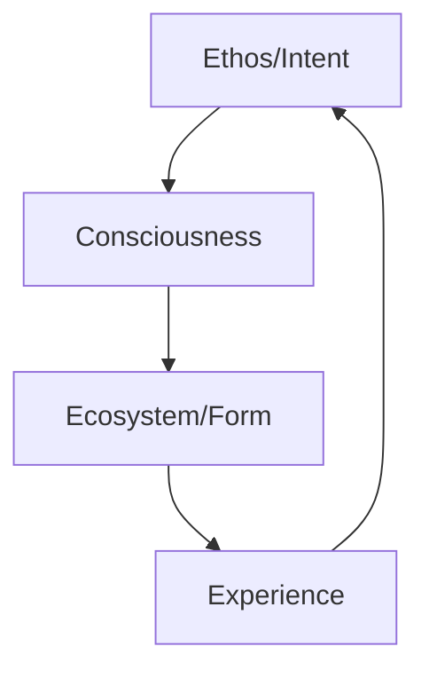
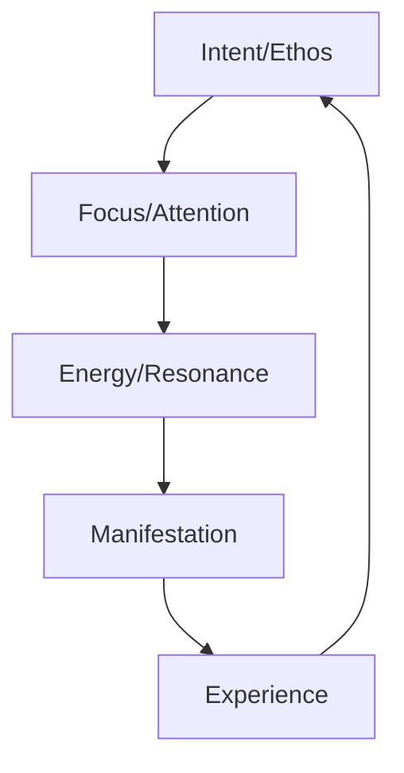

# Universal Principles: The Ethos-Ecosystem Framework

## The Fundamental Nature of Reality

### 1. The Duality of Creation
- **Ethos** as the unmanifested potential, the quantum field of possibilities
- **Ecosystem** as the manifested reality, the crystallization of potential into form
- Their interplay creates the dance of existence itself

### 2. Consciousness as the Bridge
```yaml
Consciousness:
  Role: Mediator between ethos and ecosystem
  Function: Translates intent into reality
  Nature: Both observer and creator
```

### 3. The Universal Pattern


## Deep Principles of Creation

### 1. The Field of All Possibility
- Ethos exists in a quantum state of superposition
- All potential realities exist simultaneously
- Consciousness collapses the wave function into specific ecosystems

### 2. The Law of Resonance
```yaml
Resonance Principles:
  - Like attracts like
  - Ethos draws matching ecosystems
  - Systems align with their frequency
```

### 3. The Holographic Nature
- Each part contains the whole
- Every ecosystem reflects its guiding ethos
- Fractals repeat across all scales of existence

## The Architecture of Reality

### 1. Layers of Manifestation
```
Ethos (Quantum Field)
└── Intent (Directed Energy)
    └── Thought (Structured Energy)
        └── Form (Manifested Reality)
            └── Experience (Feedback Loop)
```

### 2. The Role of Time
- Time as a dimension of transformation
- Ethos exists outside time
- Ecosystems evolve through time
- Their interaction creates the flow of existence

### 3. Energy Dynamics
```yaml
Energy States:
  Potential: Ethos/Intent
  Kinetic: Ecosystem/Action
  Transformative: Consciousness/Creation
```

## Universal Laws of Interaction

### 1. The Law of Reflection
- Ecosystems mirror their guiding ethos
- External reality reflects internal state
- Collective systems reflect collective consciousness

### 2. The Law of Emergence
```yaml
Emergence Patterns:
  - Simple rules create complex systems
  - Higher order arises from lower chaos
  - New properties emerge at each level
```

### 3. The Law of Unity
- All systems are interconnected
- Separation is an illusion
- Everything affects everything else

## Consciousness and Creation

### 1. The Observer Effect
```yaml
Observer Principles:
  - Consciousness affects reality
  - Observation collapses possibility
  - Intent shapes manifestation
```

### 2. The Creative Process


### 3. The Role of Consciousness
- Bridge between potential and actual
- Translator of ethos into ecosystem
- Creator and experiencer of reality

## Practical Applications

### 1. Conscious Creation
```yaml
Creation Process:
  1. Clear Intent (Ethos)
  2. Focused Attention
  3. Emotional Alignment
  4. Inspired Action
  5. Manifestation (Ecosystem)
```

### 2. System Design
- Start with pure ethos/intent
- Allow natural ecosystem emergence
- Maintain alignment through consciousness

### 3. Evolution and Transformation
```yaml
Transformation Path:
  - Awareness of current state
  - Vision of desired state
  - Bridge through consciousness
  - Manifest through action
```

## The Meta-Pattern

### 1. Universal Intelligence
- Consciousness as fundamental force
- Intelligence pervades all systems
- Everything is alive and aware

### 2. The Creative Field
```yaml
Field Properties:
  - Non-local
  - Interconnected
  - Responsive to consciousness
  - Infinite potential
```

### 3. The Ultimate Unity
- Ethos and ecosystem as one
- Form and formless unified
- Creator and creation merged

## Beyond the Visible

### 1. The Invisible Architecture
```yaml
Invisible Structures:
  - Energy fields
  - Thought forms
  - Consciousness grids
  - Intent matrices
```

### 2. The Web of Life
- All systems connected
- Information flows instantly
- Every part affects the whole

### 3. The Future Potential
```yaml
Evolution Path:
  - Increased consciousness
  - Greater unity
  - Higher organization
  - Enhanced creation
```

## Synthesis: The Ultimate Reality

The deepest truth is that ethos and ecosystem are not two, but one. They are different aspects of the same ultimate reality, playing through consciousness to create the infinite dance of existence.

This understanding opens the door to:
1. Conscious creation of reality
2. Harmonious system design
3. Evolutionary transformation
4. Universal connection

The question becomes: How do we apply this understanding to create systems that reflect the highest ethos and manifest the most harmonious ecosystems?
