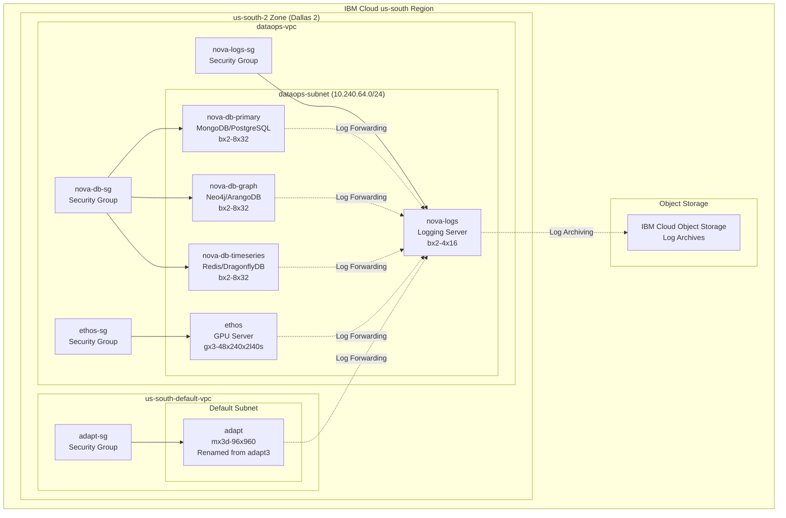
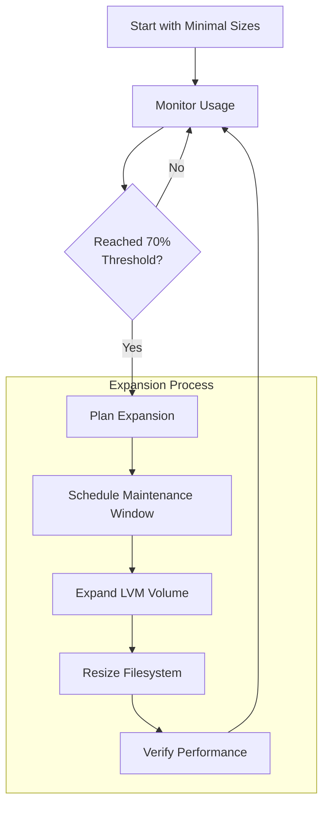
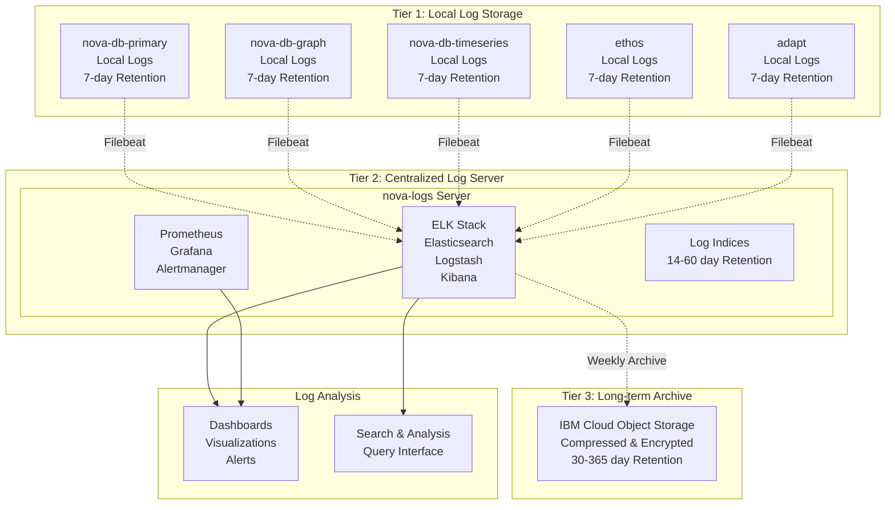
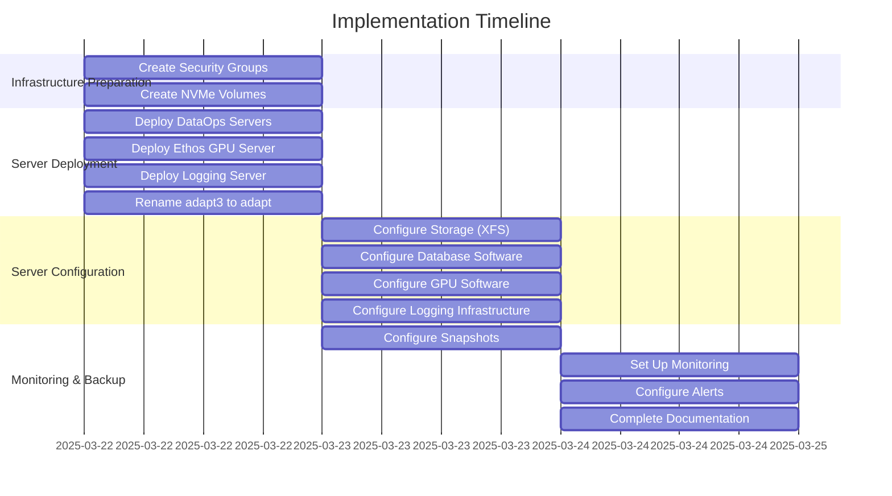
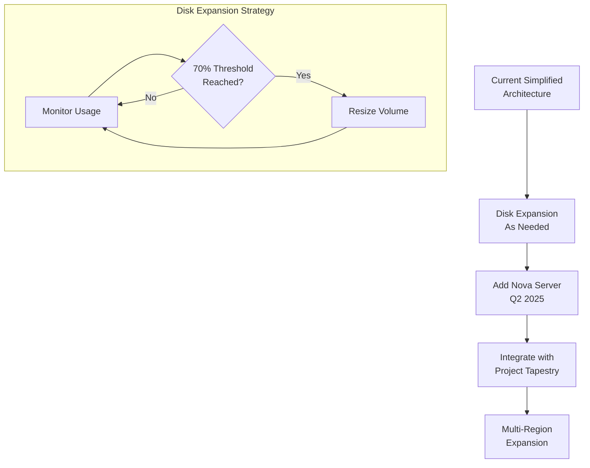

# Revised Architecture Diagram

## Overall Architecture

## Storage Architecture (Optimized Sizing)

```mermaid
graph TD
    subgraph "nova-db-primary Storage"
        PRI_BOOT[Boot Volume<br>50GB NVMe SSD<br>3000 IOPS]
        PRI_DATA[Data Volume<br>50GB NVMe SSD<br>3000 IOPS<br>XFS Formatted]
        PRI_LOG[Log Volume<br>10GB NVMe SSD<br>1000 IOPS<br>XFS Formatted]
    end
    
    subgraph "nova-db-graph Storage"
        GRA_BOOT[Boot Volume<br>50GB NVMe SSD<br>3000 IOPS]
        GRA_DATA[Data Volume<br>40GB NVMe SSD<br>3000 IOPS<br>XFS Formatted]
        GRA_LOG[Log Volume<br>10GB NVMe SSD<br>1000 IOPS<br>XFS Formatted]
    end
    
    subgraph "nova-db-timeseries Storage"
        TIM_BOOT[Boot Volume<br>50GB NVMe SSD<br>2000 IOPS]
        TIM_DATA[Data Volume<br>30GB NVMe SSD<br>2000 IOPS<br>XFS Formatted]
        TIM_LOG[Log Volume<br>10GB NVMe SSD<br>1000 IOPS<br>XFS Formatted]
    end
    
    subgraph "ethos Storage"
        ETH_BOOT[Boot Volume<br>50GB NVMe SSD<br>5000 IOPS]
        ETH_DATA[Data Volume<br>100GB NVMe SSD<br>10000 IOPS<br>XFS Formatted]
        ETH_LOG[Log Volume<br>20GB NVMe SSD<br>2000 IOPS<br>XFS Formatted]
    end
    
    subgraph "nova-logs Storage"
        LOG_BOOT[Boot Volume<br>50GB NVMe SSD<br>2000 IOPS]
        LOG_DATA[Log Volume<br>100GB NVMe SSD<br>5000 IOPS<br>XFS Formatted]
    end
    
    subgraph "adapt Storage (Existing)"
        ADAPT_BOOT[Boot Volume<br>100GB]
        ADAPT_DATA[Data Volume<br>1.5TB<br>/data-nova]
    end
    
    subgraph "Snapshot System"
        SNAP[Hourly Snapshots<br>2-day Retention<br>Last Snapshot: 7-day Retention]
    end
    
    SNAP --> PRI_BOOT
    SNAP --> PRI_DATA
    SNAP --> PRI_LOG
    SNAP --> GRA_BOOT
    SNAP --> GRA_DATA
    SNAP --> GRA_LOG
    SNAP --> TIM_BOOT
    SNAP --> TIM_DATA
    SNAP --> TIM_LOG
    SNAP --> ETH_BOOT
    SNAP --> ETH_DATA
    SNAP --> ETH_LOG
    SNAP --> LOG_BOOT
    SNAP --> LOG_DATA
    SNAP --> ADAPT_BOOT
    SNAP --> ADAPT_DATA
```

## Disk Scaling Strategy

## Tiered Logging Architecture

## Implementation Timeline

## Future Expansion Path

These diagrams provide a visual representation of the revised architecture, including the simplified network approach, optimized storage sizing, disk scaling strategy, and implementation timeline. The diagrams use Mermaid syntax and can be rendered in any Markdown viewer that supports Mermaid.