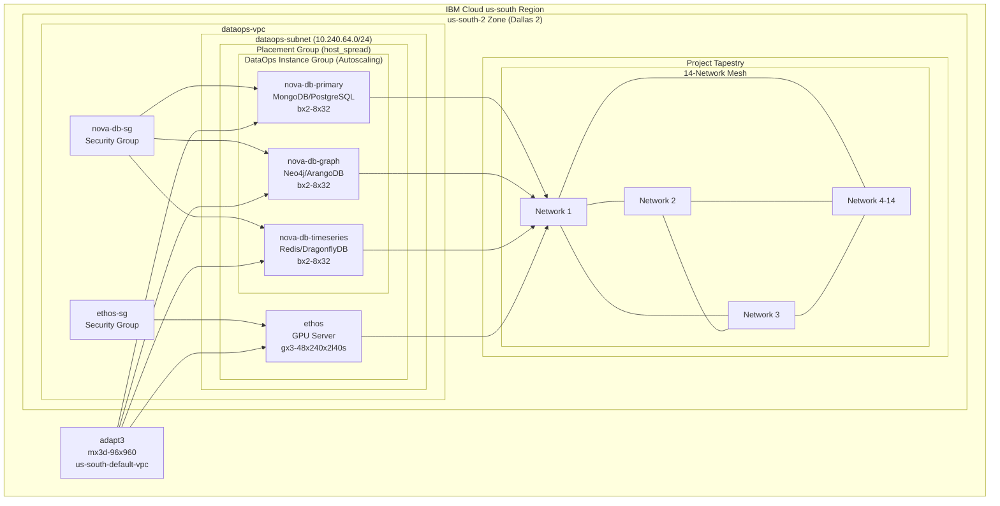
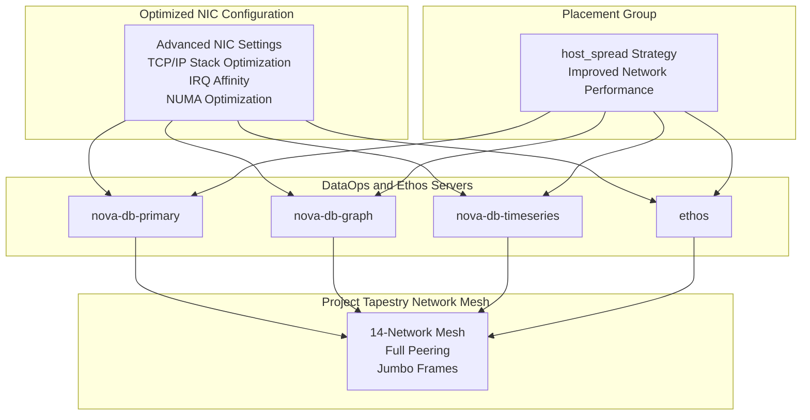
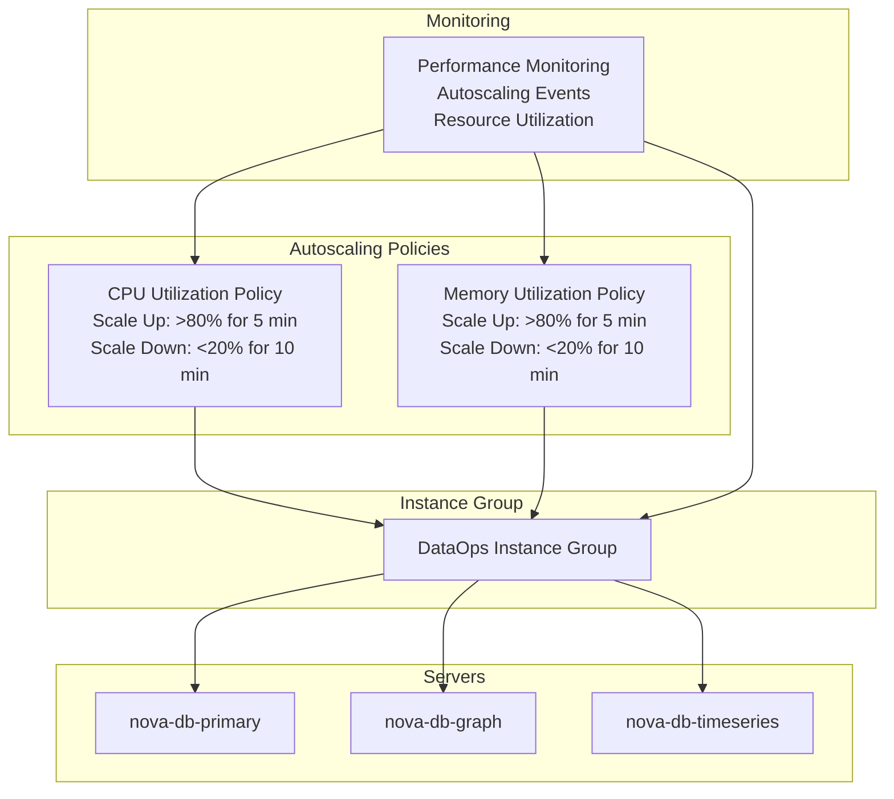
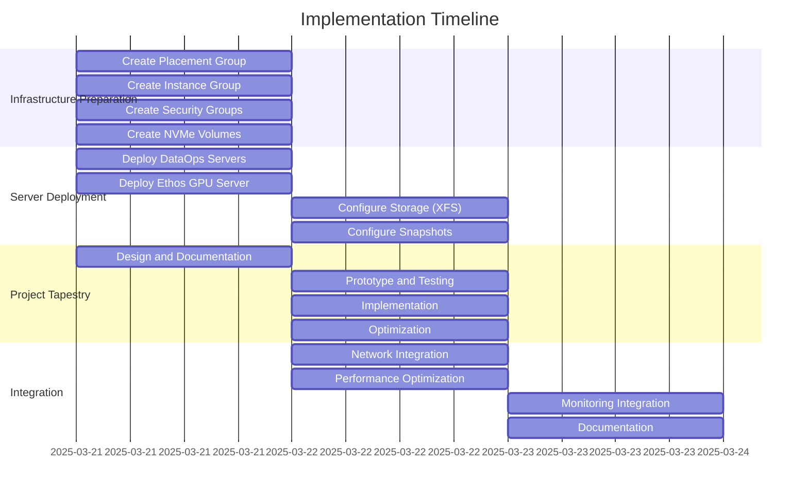

# Architecture Diagram for Implementation Plan

## Overall Architecture

## Storage Architecture

```mermaid
graph TD
    subgraph "nova-db-primary Storage"
        PRI_BOOT[Boot Volume<br>100GB NVMe SSD<br>3000 IOPS]
        PRI_DATA[Data Volume<br>100GB NVMe SSD<br>3000 IOPS<br>XFS Formatted]
        PRI_BACKUP[Backup Volume<br>200GB NVMe SSD<br>1000 IOPS<br>XFS Formatted]
    end
    
    subgraph "nova-db-graph Storage"
        GRA_BOOT[Boot Volume<br>100GB NVMe SSD<br>3000 IOPS]
        GRA_DATA[Data Volume<br>80GB NVMe SSD<br>3000 IOPS<br>XFS Formatted]
        GRA_BACKUP[Backup Volume<br>160GB NVMe SSD<br>1000 IOPS<br>XFS Formatted]
    end
    
    subgraph "nova-db-timeseries Storage"
        TIM_BOOT[Boot Volume<br>100GB NVMe SSD<br>2000 IOPS]
        TIM_DATA[Data Volume<br>60GB NVMe SSD<br>2000 IOPS<br>XFS Formatted]
        TIM_BACKUP[Backup Volume<br>120GB NVMe SSD<br>1000 IOPS<br>XFS Formatted]
    end
    
    subgraph "ethos Storage"
        ETH_BOOT[Boot Volume<br>100GB NVMe SSD<br>5000 IOPS]
        ETH_DATA[Data Volume<br>500GB NVMe SSD<br>10000 IOPS<br>XFS Formatted]
        ETH_BACKUP[Backup Volume<br>200GB NVMe SSD<br>1000 IOPS<br>XFS Formatted]
    end
    
    subgraph "Snapshot System"
        SNAP[Hourly Snapshots<br>2-day Retention<br>Last Snapshot: 7-day Retention]
    end
    
    SNAP --> PRI_BOOT
    SNAP --> PRI_DATA
    SNAP --> PRI_BACKUP
    SNAP --> GRA_BOOT
    SNAP --> GRA_DATA
    SNAP --> GRA_BACKUP
    SNAP --> TIM_BOOT
    SNAP --> TIM_DATA
    SNAP --> TIM_BACKUP
    SNAP --> ETH_BOOT
    SNAP --> ETH_DATA
    SNAP --> ETH_BACKUP
```

## Network Integration

## Autoscaling Configuration

## Implementation Timeline

These diagrams provide a visual representation of the architecture, storage configuration, network integration, autoscaling setup, and implementation timeline for our plan. The diagrams use Mermaid syntax and can be rendered in any Markdown viewer that supports Mermaid.