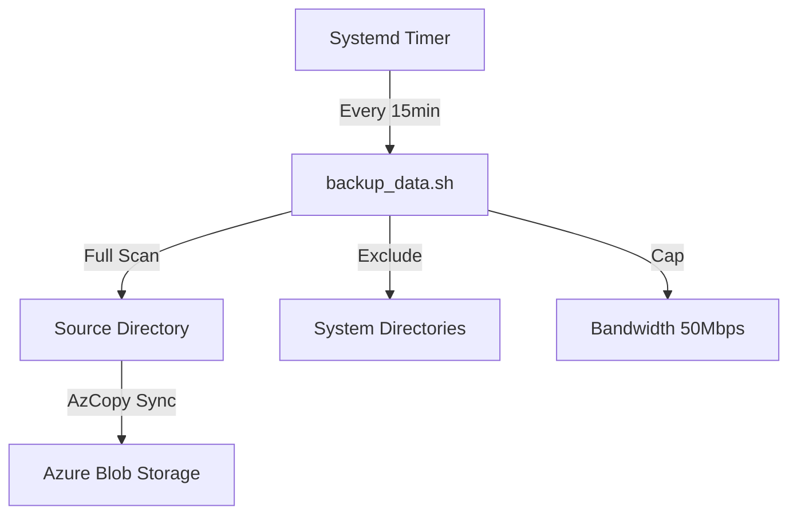
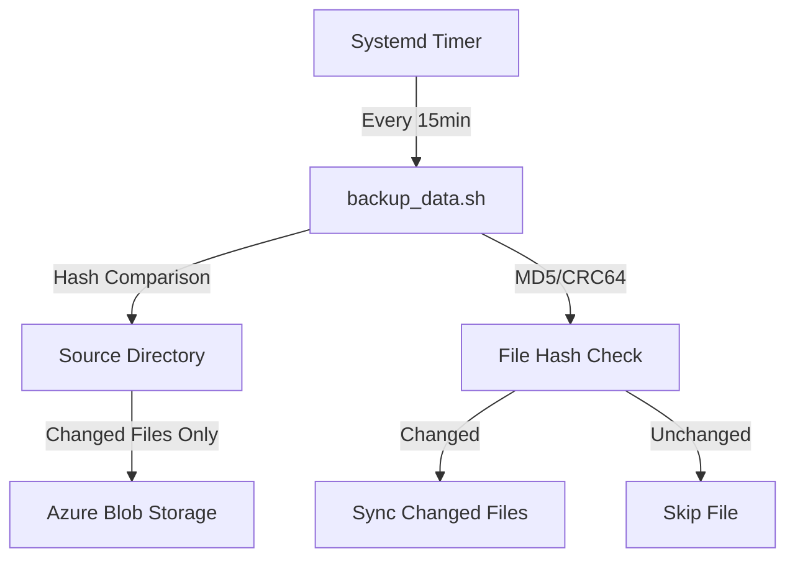

# AzCopy Backup System Patterns

## Current Backup Pattern


## Issues with Current Pattern
1. Inefficient Scanning
   - Full directory scan on each run
   - No hash-based comparison
   - High I/O impact

2. Resource Usage
   - Excessive network usage
   - High disk I/O
   - Long execution times

## Proposed Improved Pattern


## Implementation Patterns
1. Hash-Based Comparison
   ```bash
   azcopy sync
   --compare-hash=MD5
   --delete-destination=false
   --recursive
   ```

2. Progress Monitoring
   ```bash
   --log-level=INFO
   --output-type=json
   ```

3. Resource Management
   ```bash
   --cap-mbps=50
   --block-size-mb=100
   ```

4. Error Handling
   ```bash
   --retry-on-error=true
   --retry-count=3
   ```

## Backup States
1. Initial Backup
   - Full directory scan
   - Hash calculation
   - Complete sync

2. Incremental Backup
   - Hash comparison
   - Changed files only
   - Skip unchanged

3. Error State
   - Retry logic
   - Error logging
   - Alert generation

## Monitoring Pattern
1. Progress Tracking
   - JSON output parsing
   - Real-time status updates
   - Changed files logging

2. Performance Metrics
   - Transfer speed
   - File count
   - Changed file size
   - Execution time