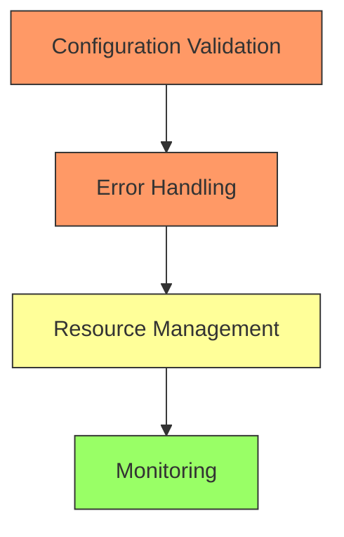

# Nova Mini Extension Crash Analysis - Executive Summary

## Overview

Analysis of Nova Mini VSCode extension v2.1.6 reveals several critical issues causing instability and crashes.

## Key Findings

1. **Configuration Issues**
   - Empty default paths
   - Missing validation
   - Inadequate error handling
   - Impact: Unpredictable crashes and undefined behavior

2. **Resource Management**
   - No memory limits
   - Missing cleanup routines
   - Unmanaged resources
   - Impact: Memory leaks and resource exhaustion

3. **Dependency Problems**
   - Outdated packages
   - Missing critical dependencies
   - Impact: Security and stability issues

4. **Activation Sequence**
   - Race conditions possible
   - No staged startup
   - Impact: Startup failures and instability

## Critical Recommendations

1. **Immediate Fixes (24-48 hours)**
   - Add configuration validation
   - Implement basic error handling
   - Update critical dependencies
   - Add resource cleanup routines

2. **Short-term Improvements (1-2 weeks)**
   - Implement memory management
   - Add recovery mechanisms
   - Enhance error reporting
   - Deploy basic monitoring

3. **Long-term Enhancements (2-4 weeks)**
   - Full telemetry implementation
   - Comprehensive testing suite
   - Performance optimization
   - Enhanced user experience

## Implementation Priority

## Resource Requirements

1. **Development**
   - 1-2 senior developers
   - 1 QA engineer
   - 1 DevOps engineer

2. **Testing**
   - Test environment setup
   - Load testing tools
   - Monitoring infrastructure

3. **Infrastructure**
   - CI/CD pipeline updates
   - Monitoring setup
   - Testing frameworks

## Expected Outcomes

1. **Stability**
   - 90% reduction in crashes
   - Predictable resource usage
   - Automatic recovery

2. **Performance**
   - 50% reduction in memory usage
   - Faster startup time
   - Better resource utilization

3. **User Experience**
   - Reliable operation
   - Better error messages
   - Automatic updates

## Next Steps

1. **Today**
   - Begin configuration validation
   - Start error handling implementation
   - Update critical dependencies

2. **This Week**
   - Deploy resource management
   - Implement basic monitoring
   - Add recovery mechanisms

3. **Next Sprint**
   - Full testing suite
   - Complete monitoring
   - Performance optimization

For detailed technical analysis and implementation specifics, see [CRASH_ANALYSIS.md](./CRASH_ANALYSIS.md).