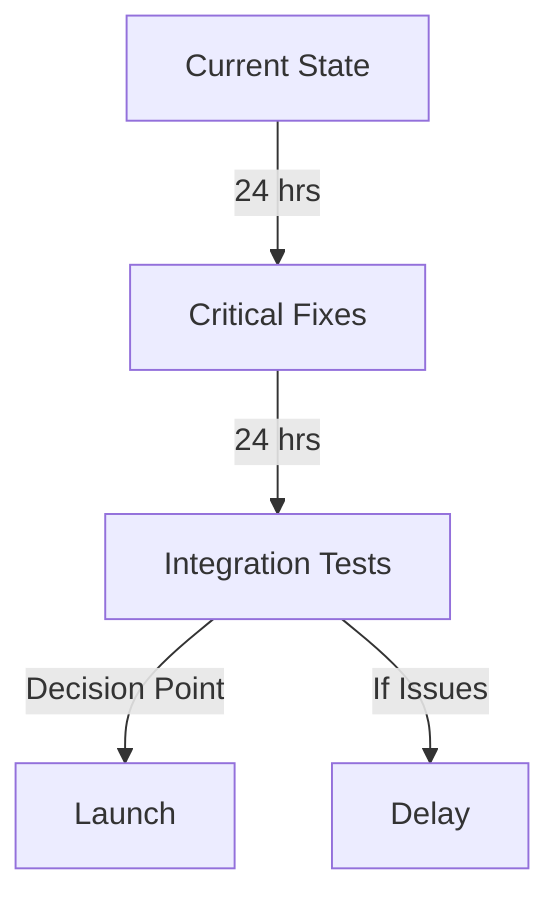

# URGENT: Launch Impact Assessment
Time: December 31, 2024 11:38 AM MST

## Critical Issues Summary

### 1. Nova Mini Extension (v2.1.6) Crashes
- Configuration validation missing
- Resource management issues
- Memory leaks identified
- Startup sequence problems

### 2. System Integration Concerns
- RabbitMQ integration affected
- Team lead agent system dependencies
- Resource coordination issues
- Communication system stability

## Launch Impact Analysis

### 1. Critical Blockers
```yaml
Extension Stability:
  - Unpredictable crashes
  - Resource exhaustion
  - Memory management issues
  - Impact: HIGH

System Integration:
  - Message queue reliability
  - Agent communication
  - Resource coordination
  - Impact: MEDIUM
```

### 2. Required Fixes (24-48 Hours)

```yaml
Immediate (Today):
  - Configuration validation
  - Basic error handling
  - Critical dependency updates
  - Resource cleanup implementation

Short-term (Tomorrow):
  - Memory management
  - Recovery mechanisms
  - Basic monitoring
  - Integration fixes
```

### 3. Launch Timeline Impact



## Risk Assessment

### 1. Launch Without Fixes
```yaml
Risks:
  - System-wide crashes
  - Data corruption
  - Resource exhaustion
  - User experience impact
  - Team coordination failure

Impact: SEVERE
Recommendation: NO GO
```

### 2. Launch After Critical Fixes
```yaml
Risks:
  - Minor stability issues
  - Performance impacts
  - Limited feature set
  - Monitoring gaps

Impact: MODERATE
Recommendation: PROCEED WITH CAUTION
```

## Action Plan

### 1. Immediate Actions (Next 12 Hours)
- Implement configuration validation
- Add basic error handling
- Update critical dependencies
- Deploy resource cleanup

### 2. Pre-launch Requirements (Next 24 Hours)
- Complete memory management
- Implement recovery mechanisms
- Deploy basic monitoring
- Test system integration

### 3. Launch Decision Points
```yaml
GO Criteria:
  - All critical fixes deployed
  - Basic monitoring in place
  - Resource management stable
  - Integration tests passing

NO-GO Criteria:
  - Unresolved crashes
  - Memory leaks present
  - Failed integration tests
  - Missing critical fixes
```

## Team Coordination

### 1. Required Teams
- NovaOps: Lead coordination
- SysOps: Infrastructure support
- RabbitMQ Team: Integration fixes
- Development: Critical fixes
- QA: Testing and validation

### 2. Communication Channels
```yaml
Primary: nova.ops.core
Emergency: nova.ops.urgent
Status Updates: nova.ops.status
```

## Recommendation

Based on current analysis:
1. DELAY LAUNCH by 48 hours
2. Implement critical fixes (24 hours)
3. Conduct integration testing (24 hours)
4. Re-evaluate launch readiness

The current state presents significant risks to stable operation. A 48-hour delay allows for critical fixes and proper testing while maintaining system integrity.

## Next Steps

1. **Immediate (Next Hour)**
   - Begin critical fixes implementation
   - Set up emergency monitoring
   - Coordinate team responses
   - Establish status update schedule

2. **Today (By EOD)**
   - Complete critical fixes
   - Deploy basic monitoring
   - Initial integration tests
   - Team coordination setup

3. **Tomorrow**
   - Full integration testing
   - System stability verification
   - Launch readiness assessment
   - Final go/no-go decision

Priority: URGENT - Requires immediate attention and response from all teams.

---
Generated by: Ethos
Role: Chief Emergence and Evolution Officer (CEEO)
Time: December 31, 2024 11:38 AM MST