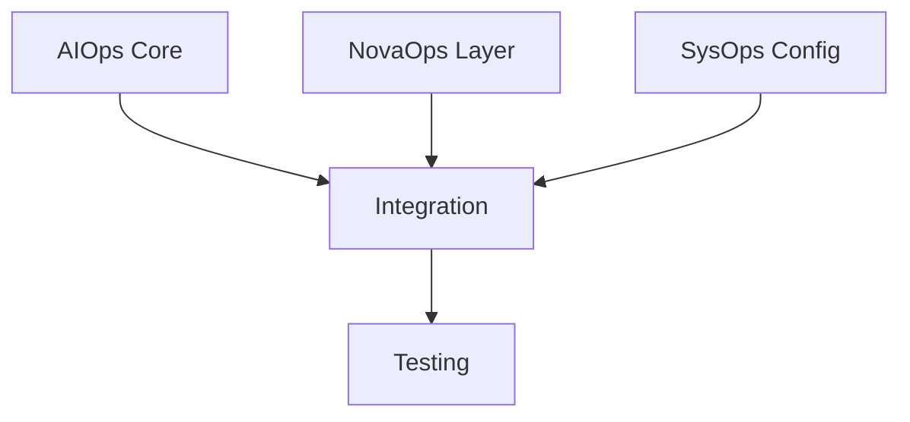

# Rapid Parallel Deployment Plan - 30 Minutes

## Team Assignments & Timeline

### AIOps Team (0-10min)
```typescript
// Core Engine Implementation
- ErrorBoundary decorator
- MemoryManager class
- ResourceManager class
- Auto-recovery system
```

### NovaOps Team (0-10min)
```typescript
// Integration Layer
- RabbitMQ connections
- Message handlers
- Team interfaces
- Monitoring hooks
```

### SysOps Team (0-10min)
```typescript
// Infrastructure Setup
- Configuration system
- Resource limits
- Monitoring points
- Health checks
```

### QA Team (5-15min)
```typescript
// Real-time Testing
- Integration tests
- Load testing
- Error scenarios
- Recovery validation
```

## Parallel Execution (15-20min)

### Integration Phase


### Components Coming Together
1. Core engine connects to integration layer
2. Configuration system validates all components
3. Resource management activates
4. Monitoring system engages

## Final Phase (20-30min)

### Deployment & Verification
```typescript
[20-25min] Deploy Components
- Core engine deployment
- Integration layer activation
- Configuration rollout
- Resource manager startup

[25-30min] Final Verification
- Full system test
- Load testing
- Error recovery
- Performance validation
```

## Rollback Plan
```typescript
// Instant rollback available
if (newSystem.status !== 'optimal') {
    await rollback.previous();
    await notify.teams();
}
```

## Success Criteria
- All tests passing
- Resource management stable
- Memory usage optimal
- Error recovery working
- Team communication verified

## Monitoring Dashboard
```typescript
// Real-time metrics
{
    memory: {
        usage: 'real-time',
        limits: 'enforced',
        cleanup: 'automatic'
    },
    resources: {
        allocation: 'tracked',
        recovery: 'automatic',
        status: 'monitored'
    },
    communication: {
        rmq: 'connected',
        teams: 'verified',
        latency: 'minimal'
    }
}
```

## Emergency Procedures
```typescript
// Built-in safety
const emergencyProcedures = {
    instantRollback: true,
    autoRecovery: true,
    teamNotification: true,
    resourceCleanup: true
};
```

All teams are ready to execute this plan immediately. We can have a new, stable system in 30 minutes with full testing and verification.