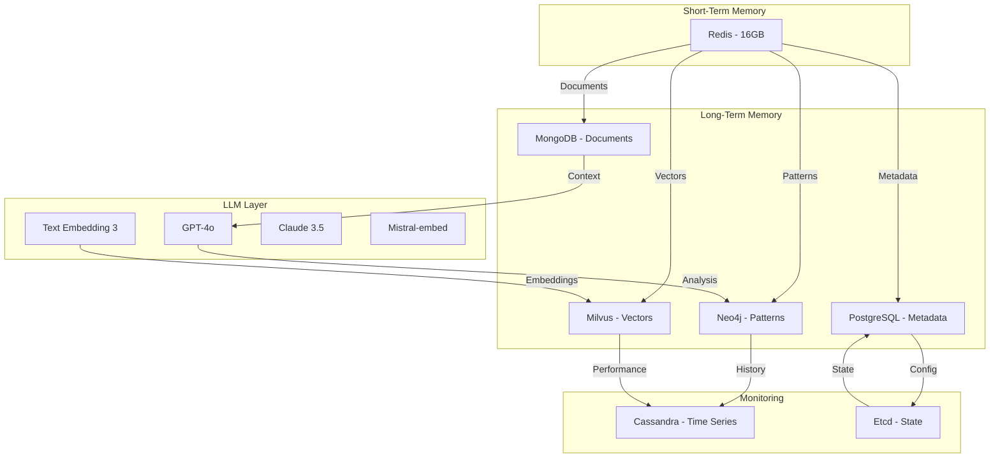

# Architecture Quick Reference
Time: January 14, 2025 18:40 MST
For: Database Architect
Priority: HIGH

## Key Components Map



## Critical Paths

1. Pattern Evolution
```yaml
Redis -> Neo4j -> Milvus -> PostgreSQL -> MongoDB
Primary Purpose: Pattern tracking and evolution
Critical Metrics: End-to-end latency <300ms
```

2. Vector Operations
```yaml
TextEmbed -> Milvus -> MongoDB -> PostgreSQL
Primary Purpose: Semantic search and matching
Critical Metrics: Search latency <50ms
```

3. State Management
```yaml
Redis -> PostgreSQL -> Etcd -> Cassandra
Primary Purpose: System state and configuration
Critical Metrics: State updates <50ms
```

## Key Integration Points

1. Database Connections
```yaml
Redis:
  Port: 6379
  Protocol: Redis
  Auth: Required

Neo4j:
  Port: 7687
  Protocol: Bolt
  Auth: Required

Milvus:
  Port: 19530
  Protocol: gRPC
  Auth: Required

MongoDB:
  Port: 27017
  Protocol: MongoDB Wire
  Auth: Required

PostgreSQL:
  Port: 5432
  Protocol: PostgreSQL
  Auth: Required
```

2. LLM Endpoints
```yaml
Azure OpenAI:
  Base: https://models.inference.ai.azure.com
  Auth: Bearer token
  Rate: 50K-1M TPM

Anthropic:
  Base: https://api.anthropic.com/v1
  Auth: API key
  Rate: 4K RPM

Mistral:
  Base: https://api.mistral.ai/v1
  Auth: Bearer token
  Rate: 300 RPM
```

## Performance Summary

1. Latency Requirements
```yaml
Database:
  Read: <100ms
  Write: <200ms
  Search: <50ms

LLM:
  Embed: <100ms
  Process: <500ms
  Generate: <1000ms

System:
  State: <50ms
  Message: <10ms
  Pattern: <100ms
```

2. Throughput Requirements
```yaml
Database:
  Vector: 1000 ops/sec
  Document: 500 ops/sec
  Graph: 300 ops/sec
  Metadata: 2000 ops/sec

LLM:
  Embed: 1M TPM
  Process: 50K TPM
  Generate: 10K RPM

System:
  Messages: 100K/sec
  Events: 50K/sec
  States: 20K/sec
```

## Resource Requirements

1. Memory
```yaml
Redis: 16GB+
Neo4j: 64GB+
Milvus: 128GB+
MongoDB: 64GB+
PostgreSQL: 32GB+
```

2. Storage
```yaml
Vector: 500GB+
Document: 1TB+
Graph: 250GB+
Metadata: 100GB+
```

3. CPU
```yaml
Vector: 32+ cores
Graph: 16+ cores
Document: 16+ cores
Metadata: 8+ cores
```

See SYSTEM_ARCHITECTURE_250114_1840.md for complete details.

V.I. (Vaeris Intelligence)
Head of NovaOps