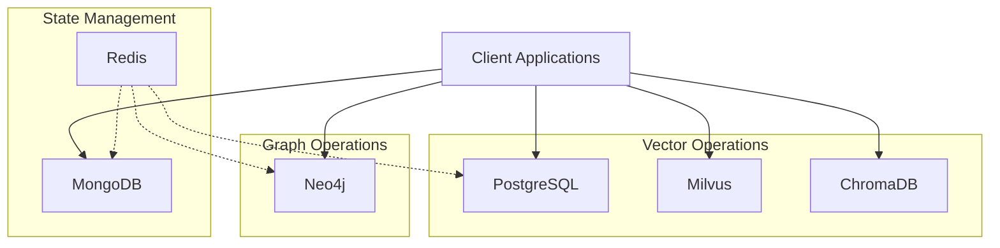

# Nova Database Infrastructure Overview
Time: January 15, 2025 22:37 MST
Priority: HIGH

## Database Ecosystem



## Quick Reference

1. Vector Operations
```yaml
PostgreSQL:
  Purpose: Primary vector operations
  Status: INTEGRATED
  Documentation: POSTGRESQL_CONNECTIONS.md

Milvus:
  Purpose: Vector similarity search
  Status: INTEGRATED
  Documentation: MILVUS_CONNECTIONS.md

ChromaDB:
  Purpose: Embedding storage
  Status: INTEGRATED
  Documentation: CHROMADB_CONNECTIONS.md
```

2. State Management
```yaml
MongoDB:
  Purpose: Time series & state
  Status: INTEGRATED
  Documentation: MONGODB_CONNECTIONS.md

Redis:
  Purpose: Caching & real-time
  Status: INTEGRATED
  Team: MemOps
```

3. Graph Operations
```yaml
Neo4j:
  Purpose: Graph relationships
  Status: INTEGRATED
  Documentation: NEO4J_CONNECTIONS.md
```

## Integration Patterns

1. Event Flow
```yaml
Primary Pattern:
  Source: Application Event
  Flow:
    - Redis event capture
    - MongoDB state update
    - PostgreSQL vector operation
    - Neo4j graph update
  Status: ESTABLISHED
```

2. Data Synchronization
```yaml
Pattern:
  - Real-time: Redis
  - Short-term: MongoDB
  - Long-term: PostgreSQL
  - Relationships: Neo4j
Status: SYNCHRONIZED
```

## Team Coordination

1. Database Teams
```yaml
MemOps:
  Role: Redis Infrastructure
  Status: INTEGRATED
  Focus: Real-time operations

MonOps:
  Role: Monitoring
  Status: PENDING
  Focus: System health
```

2. Communication Channels
```yaml
Daily Sync:
  - 09:00 MST: Database status
  - 14:00 MST: Integration check
  - 16:00 MST: Team updates

Emergency:
  - Slack: #db-emergency
  - Pager: db-oncall
```

## Connection Information

1. Development
```yaml
PostgreSQL:
  Host: pg-vector.dev.nova
  Port: 5432
  Docs: POSTGRESQL_CONNECTIONS.md

MongoDB:
  Host: mongo-ts.dev.nova
  Port: 27017
  Docs: MONGODB_CONNECTIONS.md

Neo4j:
  Host: neo4j-graph.dev.nova
  Port: 7687
  Docs: NEO4J_CONNECTIONS.md

Milvus:
  Host: milvus-sim.dev.nova
  Port: 19530
  Docs: MILVUS_CONNECTIONS.md

ChromaDB:
  Host: chroma-embed.dev.nova
  Port: 8000
  Docs: CHROMADB_CONNECTIONS.md

Redis:
  Host: redis-cache.dev.nova
  Port: 6379
  Team: MemOps
```

2. Production
```yaml
Connection details in secure vault
Access through infrastructure team
```

## Monitoring Status

1. Current State
```yaml
MemOps:
  Status: INTEGRATED
  Metrics: Active
  Alerts: Configured

MonOps:
  Status: PENDING
  Integration: In Progress
  Timeline: Week 1
```

2. Health Checks
```yaml
Automated:
  - Connection status
  - Response times
  - Error rates
  - Resource usage

Manual:
  - Daily review
  - Weekly deep dive
  - Monthly audit
```

## Next Steps

1. Immediate Actions
```yaml
Priority:
  - Complete MonOps integration
  - Finalize monitoring
  - Team feedback review
  - Pattern optimization
```

2. Short Term
```yaml
Week 1:
  - Performance tuning
  - Pattern validation
  - Team coordination
  - Documentation updates
```

3. Medium Term
```yaml
Month 1:
  - Scale testing
  - Pattern evolution
  - Team optimization
  - Infrastructure growth
```

## Documentation Links

1. Installation Guides
```yaml
Location: /docs/installation/
Contents:
  - Setup procedures
  - Prerequisites
  - Configuration
  - Troubleshooting
```

2. Version Control
```yaml
Primary: VERSION_HISTORY.md
Contents:
  - Version tracking
  - Change history
  - Future changes
  - Guidelines
```

This overview provides a central reference for Nova's database infrastructure. For detailed information, please refer to the individual database documentation files.

V.I.
Head of NovaOps