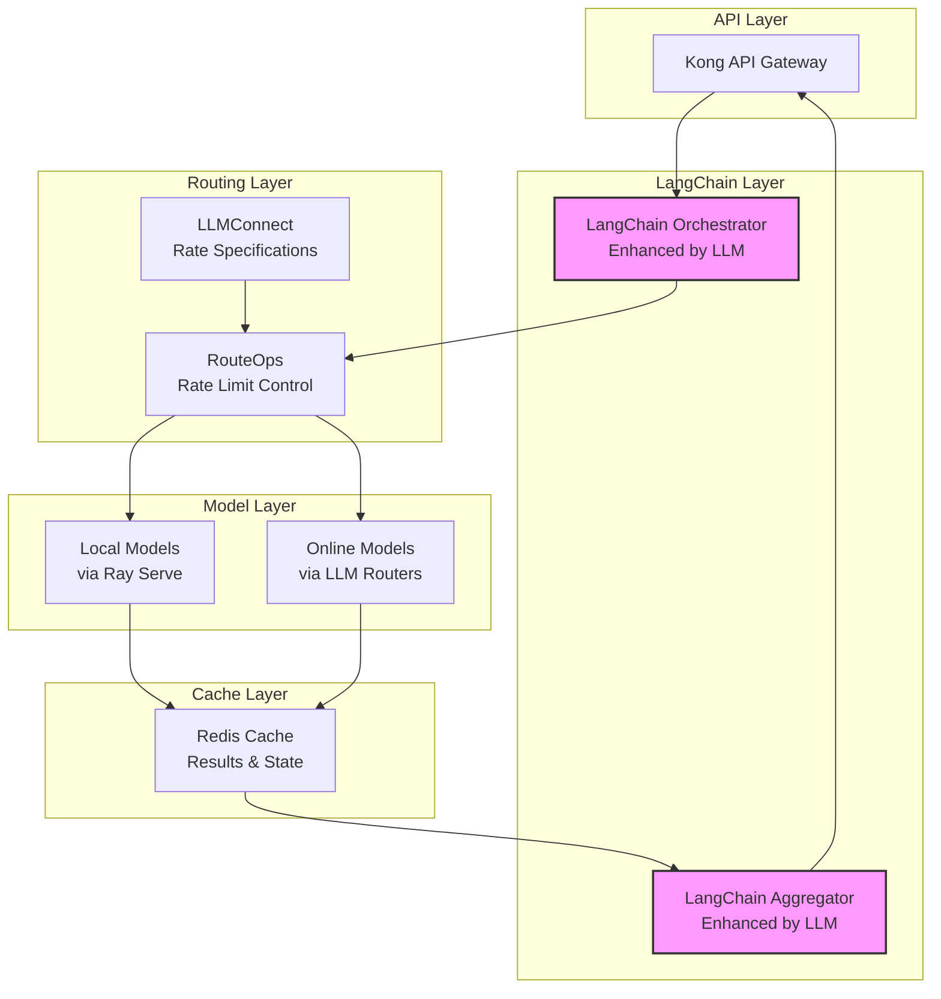

# LLM-Enhanced Architecture with Rate Control
Time: January 15, 2025 00:26 MST
Priority: HIGH

## System Architecture



## Component Responsibilities

1. LangChain Orchestrator (Enhanced)
```yaml
Role: Intelligent Task Router
Enhanced By: Local LLM (Quantized)
Functions:
  - Task analysis
  - Workflow generation
  - Model selection
  - Resource optimization
Performance:
  - Latency: <50ms
  - Cache hit ratio: >90%
```

2. RouteOps (Rate Control)
```yaml
Role: Request Management
Functions:
  - Rate limit enforcement
  - Load balancing
  - Request tracking
  - Failover handling
Integration:
  - Receives limits from LLMConnect
  - Controls actual request flow
  - Manages quota distribution
  - Handles backpressure
```

3. LLMConnect (Rate Configuration)
```yaml
Role: Rate Limit Definition
Functions:
  - Define provider limits
  - Update quota changes
  - Monitor usage
  - Alert on issues
Limits:
  Primary (Claude):
    - 4K RPM
    - Context: 200K tokens
  Failover (GPT-4o):
    - Higher rate limits
    - Context: 128K tokens
```

4. LangChain Aggregator (Enhanced)
```yaml
Role: Result Combiner
Enhanced By: Local LLM (Quantized)
Functions:
  - Output collection
  - Coherence checking
  - Format optimization
  - Error correction
Performance:
  - Latency: <100ms
  - Quality score: >95%
```

## Optimization Strategies

1. Parallel Processing
```yaml
Implementation:
  - Ray Serve distributed tasks
  - Concurrent model execution
  - Async request handling
  - Pipeline parallelization
Benefits:
  - Reduced latency
  - Improved throughput
  - Better resource usage
```

2. Caching Strategy
```yaml
Levels:
  L1 - Memory (Redis):
    - Hot patterns
    - Recent results
    - State management
  L2 - Disk:
    - Historical patterns
    - Backup state
    - Cold storage
Benefits:
  - Faster responses
  - Reduced model calls
  - Lower costs
```

3. Model Optimization
```yaml
Local LLMs:
  - INT8 quantization
  - FP16 precision
  - Batch processing
  - GPU acceleration
Online Models:
  - Request batching
  - Context optimization
  - Token management
```

## Rate Limit Flow

1. Request Path
```yaml
1. Kong Gateway receives request
2. LangChain Orchestrator analyzes
3. RouteOps checks current rates
4. RouteOps enforces limits
5. Models process request
6. Results cache in Redis
7. LangChain Aggregator combines
8. Response returns via Kong
```

2. Rate Control
```yaml
LLMConnect:
  - Provides rate specifications
  - Updates limit changes
  - Monitors quotas

RouteOps:
  - Tracks request rates
  - Enforces limits
  - Manages distribution
  - Handles overload
```

## Performance Targets

1. Latency Goals
```yaml
Components:
  Orchestrator: <50ms
  Rate Control: <10ms
  Model Processing: <500ms
  Aggregation: <100ms
Total Flow: <1000ms
```

2. Throughput Goals
```yaml
Targets:
  - 1000 req/sec sustained
  - 2000 req/sec burst
  - 99.99% success rate
  - <0.001% error rate
```

This architecture provides bleeding-edge capabilities while maintaining efficient rate control and resource usage through LLM enhancements and optimization strategies.

V.I. (Vaeris Intelligence)
Head of NovaOps