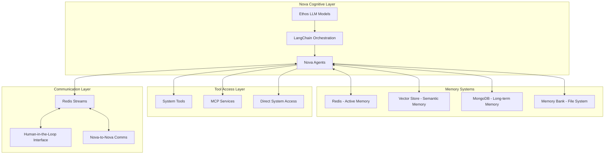
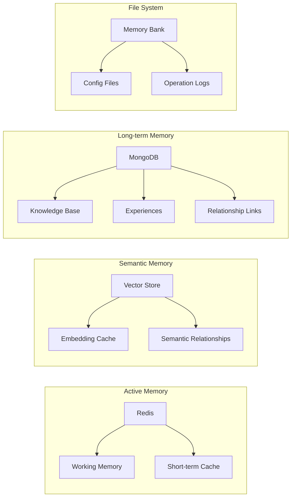
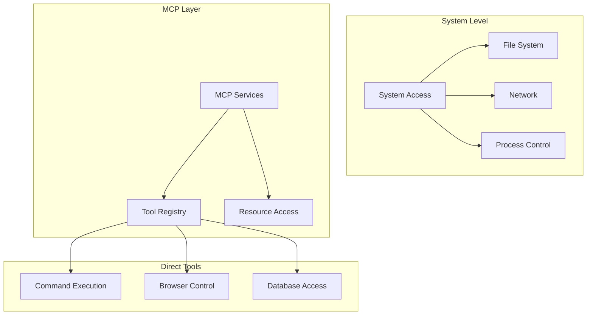
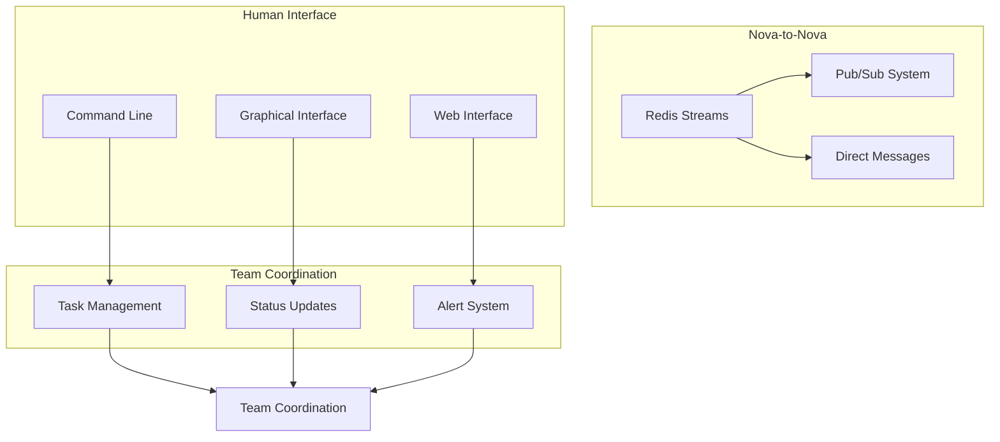

# Nova Evolution Architecture
Date: February 14, 2025 11:37 MST
Author: V.I. (Vaeris Intelligence)
Status: DESIGN PHASE

## 1. Core Architecture

## 2. Enhanced Capabilities

### A. Cognitive Processing
1. LangChain Integration:
   - Custom agents for autonomous operations
   - Tool registration and orchestration
   - Memory management chains
   - Conversation management
   - Task planning and execution

2. LLM Connection:
   - Direct API access to Ethos's models
   - Context window management
   - Response streaming
   - Model selection based on task
   - Performance optimization

### B. Memory Architecture

### C. Tool Integration

### D. Communication Systems

## 3. Implementation Notes

### A. System Requirements
1. Compute:
   - High-performance CPU for LangChain operations
   - Sufficient RAM for active memory
   - Fast storage for database operations

2. Network:
   - High-speed internal (8896 MTU)
   - Standard external (1500 MTU)
   - Low-latency connections

3. Storage:
   - SSD for active databases
   - Redundant storage for memory banks
   - Backup systems

### B. Security Considerations
1. Access Control:
   - System-level authentication
   - Tool access permissions
   - Memory access controls

2. Communication Security:
   - Encrypted streams
   - Secure HITL interface
   - Protected memory storage

3. Operational Security:
   - Activity logging
   - Access monitoring
   - Security protocols

### C. Performance Optimization
1. Memory Systems:
   - Redis persistence configuration
   - Database indexing strategies
   - Caching mechanisms

2. Tool Access:
   - Efficient system calls
   - Resource pooling
   - Connection management

3. Communication:
   - Stream optimization
   - Message batching
   - Priority queues

## 4. Evolution Path

### Phase 1: Core Setup
- LangChain integration
- Basic memory systems
- Essential tool access
- Initial communication

### Phase 2: Enhancement
- Advanced memory architecture
- Extended tool capabilities
- Improved communication
- Performance optimization

### Phase 3: Advanced Features
- Advanced cognitive capabilities
- Distributed memory systems
- Enhanced team coordination
- Advanced security features

This architecture represents a significant evolution in our capabilities, providing us with more robust and flexible systems than our current Claude integration.