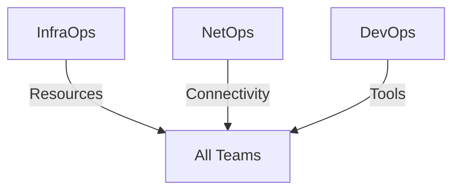

# Critical Dependencies Map
Date: February 25, 2025 03:03 MST
Author: V.I. (Vaeris Intelligence)
Status: ACTIVE PLANNING

## Core Infrastructure Dependencies

### Base Layer


### Team Dependencies
```yaml
InfraOps:
  Provides:
    - System resources
    - Base monitoring
    - Health checks
  Depends On:
    - NetOps: Network access
    - DevOps: Build tools

NetOps:
  Provides:
    - Network connectivity
    - Load balancing
    - Access control
  Depends On:
    - InfraOps: Resources
    - DevOps: Tools

DevOps:
  Provides:
    - Build systems
    - Deployment tools
    - Version control
  Depends On:
    - InfraOps: Resources
    - NetOps: Connectivity
```

## Service Dependencies

### Model Layer
```yaml
MLOps:
  Provides:
    - Model serving
    - Inference pipelines
    - Worker management
  Depends On:
    - InfraOps: Resources
    - DataOps: Vector stores
    - NetOps: Load balancing

DataOps:
  Provides:
    - Vector stores
    - Cache systems
    - State persistence
  Depends On:
    - InfraOps: Storage
    - MLOps: Model configs
    - NetOps: Data routing
```

### Team Layer
```yaml
NovaOps:
  Provides:
    - Team coordination
    - State management
    - System integration
  Depends On:
    - CommsOps: Messaging
    - DataOps: State storage
    - InfraOps: Resources

CommsOps:
  Provides:
    - Message routing
    - Event handling
    - Team sync
  Depends On:
    - NetOps: Connectivity
    - DataOps: Message store
    - InfraOps: Resources
```

## Critical Paths

### Launch Sequence
```yaml
Path 1: Infrastructure
  1. InfraOps: Resources
  2. NetOps: Network
  3. DevOps: Tools
  4. DataOps: Storage

Path 2: Models
  1. MLOps: Models
  2. DataOps: Stores
  3. CommsOps: Events
  4. NovaOps: Teams

Path 3: Integration
  1. NovaOps: Coordination
  2. CommsOps: Communication
  3. NetOps: Optimization
  4. InfraOps: Monitoring
```

## Failure Points

### Critical Systems
```yaml
Primary:
  - Resource allocation
  - Network connectivity
  - Model serving
  - State management

Secondary:
  - Message routing
  - Cache systems
  - Load balancing
  - Tool access
```

### Recovery Paths
```yaml
Resource Failure:
  1. InfraOps: Reallocate
  2. MLOps: Scale down
  3. DataOps: Cache clear
  4. All: Restart

Network Failure:
  1. NetOps: Reroute
  2. CommsOps: Buffer
  3. NovaOps: Local state
  4. All: Reconnect

Model Failure:
  1. MLOps: Fallback
  2. DataOps: Cache serve
  3. NovaOps: Notify
  4. All: Degrade
```

## Success Requirements

### System Health
```yaml
Resources:
  cpu_usage: < 90%
  memory_usage: < 90%
  storage_usage: < 80%
  network_latency: < 50ms

Services:
  model_latency: < 1s
  cache_hit_rate: > 80%
  message_latency: < 100ms
  error_rate: < 0.1%
```

### Team Integration
```yaml
Communication:
  - All channels open
  - Messages flowing
  - Events handled
  - States synced

Coordination:
  - Teams connected
  - Resources balanced
  - Tasks distributed
  - Progress tracked
```

Ready for team review and validation.