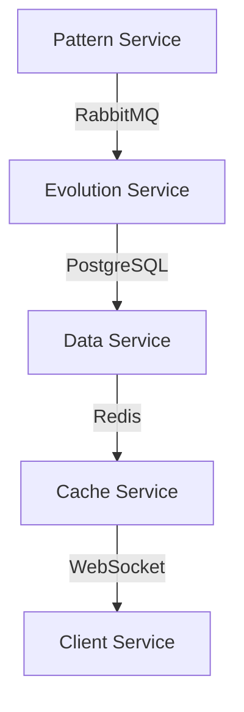

# Technical Documentation

## Implementation Details

### 1. System Architecture

#### Core Components

- **LLM Service Layer**

  - 24 validated models
  - Ultra-fast tier (0.33s latency)
  - Pattern recognition system
  - Evolution management

- **Message Routing**

  - RabbitMQ cluster
  - Dead letter handling
  - Message persistence
  - Queue optimization

- **Data Layer**

  - PostgreSQL for persistence
  - Redis for caching
  - Connection pooling
  - Data optimization

- **Monitoring Stack**
  - Centralized logging
  - Performance metrics
  - Alert management
  - Dashboard integration

### 2. Network Configuration

#### Optimization Parameters

```yaml
network:
  mtu: 8896 # Jumbo frames
  tcp:
    buffer_size: optimized
    window_size: enhanced
    backlog: increased
  performance:
    latency: < 50ms
    throughput: optimized
```

### 3. Storage Configuration

#### Logging Structure

```plaintext
/logs/
  ├── <service-name>/
  │   ├── error/
  │   ├── performance/
  │   └── system/
  └── aggregated/
      ├── metrics/
      └── patterns/
```

## Integration Patterns

### 1. Message Queue Integration

#### RabbitMQ Configuration

```yaml
rabbitmq:
  cluster:
    nodes: distributed
    vhosts: isolated
  queues:
    system_events:
      durable: true
      dead_letter: configured
    pattern_recognition:
      priority: high
      persistence: enabled
```

### 2. Database Integration

#### PostgreSQL Configuration

```yaml
postgresql:
  connection_pool:
    min_size: 10
    max_size: 100
    idle_timeout: 300s
  performance:
    statement_timeout: 30s
    work_mem: optimized
```

#### Redis Configuration

```yaml
redis:
  cache:
    max_memory: configured
    eviction_policy: volatile-lru
  persistence:
    rdb_enabled: true
    aof_enabled: true
```

### 3. API Integration

#### Endpoint Structure

```yaml
api:
  base_url: /api/v1
  endpoints:
    pattern:
      - /recognize
      - /evolve
      - /optimize
    system:
      - /health
      - /metrics
      - /status
```

## Migration Guide

### 1. Pre-Migration Steps

1. **System Backup**

   ```bash
   # Backup databases
   pg_dump -Fc nova_db > nova_backup.dump

   # Backup configurations
   tar -czf configs_backup.tar.gz /etc/nova/
   ```

2. **Service Preparation**
   ```bash
   # Stop services in order
   systemctl stop nova-pattern
   systemctl stop nova-evolution
   systemctl stop nova-router
   ```

### 2. Migration Process

1. **Database Migration**

   ```sql
   -- Schema updates
   ALTER TABLE patterns ADD COLUMN evolution_status TEXT;
   CREATE INDEX idx_pattern_evolution ON patterns(evolution_status);
   ```

2. **Configuration Updates**
   ```yaml
   # Update service configurations
   services:
     pattern:
       version: "2.0"
       features: ["evolution", "optimization"]
     router:
       version: "2.0"
       protocols: ["enhanced_routing"]
   ```

### 3. Post-Migration Steps

1. **Service Verification**

   ```bash
   # Start services in order
   systemctl start nova-router
   systemctl start nova-evolution
   systemctl start nova-pattern

   # Verify status
   nova-cli verify-migration
   ```

## API Documentation

### 1. Pattern Recognition API

#### Recognize Pattern

```yaml
POST /api/v1/pattern/recognize
Content-Type: application/json

Request:
{
  "input": "string",
  "options": {
    "model": "string",
    "threshold": float
  }
}

Response:
{
  "pattern_id": "string",
  "confidence": float,
  "matches": [
    {
      "type": "string",
      "score": float
    }
  ]
}
```

### 2. Evolution API

#### Trigger Evolution

```yaml
POST /api/v1/pattern/evolve
Content-Type: application/json

Request:
{
  "pattern_id": "string",
  "parameters": {
    "complexity": integer,
    "iterations": integer
  }
}

Response:
{
  "evolution_id": "string",
  "status": "string",
  "progress": float
}
```

## Integration Points

### 1. System Integration

#### Service Communication



### 2. Monitoring Integration

#### Metrics Collection

```yaml
metrics:
  collection:
    interval: 15s
    endpoints:
      - /metrics/pattern
      - /metrics/evolution
      - /metrics/system
  alerting:
    thresholds:
      latency: 500ms
      error_rate: 0.1%
      pattern_match: 95%
```

## System Requirements

### 1. Hardware Requirements

```yaml
compute:
  cpu: 16 cores
  memory: 64GB
  storage: 500GB SSD
network:
  bandwidth: 10Gbps
  latency: < 1ms
```

### 2. Software Requirements

```yaml
dependencies:
  python: "3.9+"
  postgresql: "14+"
  redis: "6+"
  rabbitmq: "3.9+"
monitoring:
  prometheus: required
  grafana: required
  elk_stack: required
```

## Security Considerations

### 1. Authentication

```yaml
auth:
  type: JWT
  expiration: 1h
  refresh: enabled
  mfa: required
```

### 2. Authorization

```yaml
rbac:
  roles:
    - admin
    - operator
    - viewer
  permissions:
    pattern:
      - create
      - evolve
      - view
```

## Troubleshooting Guide

### 1. Common Issues

#### Pattern Recognition Failures

```yaml
issue:
  symptom: "Low pattern match confidence"
  checks:
    - Verify input format
    - Check model status
    - Validate thresholds
  solution:
    - Adjust recognition parameters
    - Update pattern database
    - Retrain model if necessary
```

#### Evolution Stalls

```yaml
issue:
  symptom: "Evolution process stuck"
  checks:
    - Monitor resource usage
    - Check process status
    - Verify database connections
  solution:
    - Clear evolution queue
    - Reset process state
    - Restart evolution service
```
