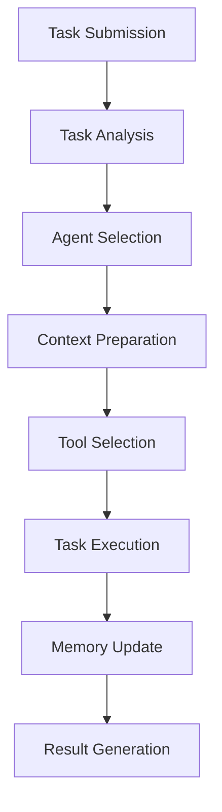
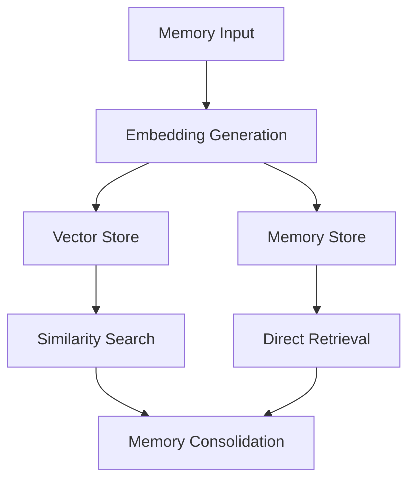

# NOVA Technical Implementation Guide

## System Architecture Details

### 1. Core Components

#### 1.1 Agent System
```python
# Agent Core Structure
class Agent:
    def __init__(self):
        self.memory = AgentMemory()
        self.state = AgentState()
        self.tools = ToolRegistry()
        self.collaborators = set()

    async def process_task(self, task: Task, context: Context):
        # 1. Analyze task
        # 2. Load relevant memories
        # 3. Select appropriate tools
        # 4. Execute task steps
        # 5. Update memory
        pass
```

#### 1.2 Memory System
```python
# Memory Hierarchy
class MemoryStore:
    def __init__(self):
        self.episodic = {}    # Event-based memories
        self.semantic = {}    # Factual knowledge
        self.procedural = {}  # Skills and procedures
        self.working = WorkingMemory()
```

#### 1.3 Vector Store Integration
```python
# Vector Store Configuration
class VectorStoreConfig:
    provider: str            # chroma, faiss, pinecone
    collection_name: str     # Collection/index name
    dimension: int = 1536    # Embedding dimension
    metric: str = "cosine"   # Distance metric
```

### 2. Integration Patterns

#### 2.1 AI Provider Integration
```python
# Provider Interface
class AIProvider(Resource):
    async def generate(self, prompt, model=None):
        """Generate completion."""
        pass

    async def stream_generate(self, prompt, model=None):
        """Stream completion."""
        pass

    async def get_embeddings(self, texts, model=None):
        """Get text embeddings."""
        pass
```

#### 2.2 Tool Integration
```python
# Tool Registry Pattern
class ToolRegistry:
    def __init__(self):
        self._tools = {}
        self._categories = defaultdict(list)

    def register(self, tool, category=None):
        self._tools[tool.name] = tool
        if category:
            self._categories[category].append(tool.name)
```

### 3. Service Layer Implementation

#### 3.1 Memory Service
```python
class MemoryService:
    def __init__(self, store, vector_store):
        self.store = store
        self.vector_store = vector_store
        self.cache = Cache()

    async def store(self, memory):
        # 1. Generate embedding
        # 2. Store in vector store
        # 3. Update memory store
        # 4. Update cache
        pass

    async def retrieve(self, query):
        # 1. Check cache
        # 2. Generate query embedding
        # 3. Search vector store
        # 4. Load from memory store
        # 5. Update cache
        pass
```

#### 3.2 Agent Service
```python
class AgentService:
    def __init__(self):
        self.active_agents = {}
        self.agent_tasks = defaultdict(set)

    async def create_agent(self, config):
        # 1. Initialize agent
        # 2. Set up memory
        # 3. Configure tools
        # 4. Register agent
        pass

    async def assign_task(self, agent_id, task):
        # 1. Validate agent status
        # 2. Prepare context
        # 3. Submit task
        # 4. Monitor execution
        pass
```

### 4. Data Flow Patterns

#### 4.1 Task Processing Flow


#### 4.2 Memory Flow


### 5. Security Implementation

#### 5.1 Authentication
```python
class SecurityManager:
    def __init__(self):
        self.token_manager = TokenManager()
        self.rate_limiter = RateLimiter()

    async def authenticate(self, credentials):
        # 1. Validate credentials
        # 2. Generate token
        # 3. Set up rate limiting
        pass

    async def authorize(self, token, resource):
        # 1. Validate token
        # 2. Check permissions
        # 3. Log access
        pass
```

#### 5.2 Rate Limiting
```python
class RateLimit:
    def __init__(self, limit, window):
        self.limit = limit
        self.window = window
        self.tokens = limit
        self.last_update = time.time()

    def can_proceed(self):
        now = time.time()
        time_passed = now - self.last_update
        self.tokens = min(self.limit,
                         self.tokens + time_passed * 
                         (self.limit / self.window))
        if self.tokens >= 1:
            self.tokens -= 1
            self.last_update = now
            return True
        return False
```

### 6. Monitoring Implementation

#### 6.1 Metrics Collection
```python
class MetricsCollector:
    def __init__(self):
        self.metrics = defaultdict(Counter)
        self.gauges = defaultdict(float)
        self.histograms = defaultdict(list)

    async def record_metric(self, name, value, labels=None):
        # 1. Validate metric
        # 2. Update storage
        # 3. Check thresholds
        # 4. Trigger alerts
        pass
```

#### 6.2 Tracing
```python
class TracingManager:
    def __init__(self):
        self.tracer = Tracer()
        self.spans = {}

    @contextmanager
    def trace_operation(self, name, context=None):
        span = self.tracer.start_span(name, context)
        try:
            yield span
        finally:
            span.finish()
```

### 7. Error Handling

#### 7.1 Error Types
```python
class NovaError(Exception):
    """Base error for NOVA system."""
    pass

class AgentError(NovaError):
    """Agent-related errors."""
    pass

class MemoryError(NovaError):
    """Memory-related errors."""
    pass

class ProviderError(NovaError):
    """AI provider-related errors."""
    pass
```

#### 7.2 Error Recovery
```python
class ErrorHandler:
    def __init__(self):
        self.recovery_strategies = {}
        self.error_metrics = MetricsCollector()

    async def handle_error(self, error, context):
        # 1. Log error
        # 2. Update metrics
        # 3. Select recovery strategy
        # 4. Execute recovery
        # 5. Verify system state
        pass
```

### 8. Configuration Management

#### 8.1 Environment Configuration
```python
class Settings(BaseSettings):
    class Config:
        env_prefix = "NOVA_"
        env_file = ".env"
        case_sensitive = False

    # AI Providers
    openai_api_key: str
    anthropic_api_key: str

    # Database
    vector_store_url: str
    redis_url: str

    # System
    environment: str
    debug: bool = False
    log_level: str = "INFO"
```

#### 8.2 Feature Flags
```python
class FeatureFlags:
    def __init__(self):
        self.flags = {}
        self.overrides = {}

    def is_enabled(self, feature, context=None):
        # Check overrides
        if feature in self.overrides:
            return self.overrides[feature]

        # Check environment
        if self.is_production():
            return self.flags.get(feature, False)

        # Development defaults
        return True
```

### 9. Testing Strategy

#### 9.1 Unit Tests
```python
class TestAgent(unittest.TestCase):
    async def setUp(self):
        self.agent = Agent()
        self.memory = MockMemory()
        self.tools = MockTools()

    async def test_task_processing(self):
        task = Task(type="test")
        result = await self.agent.process_task(task)
        self.assertIsNotNone(result)
```

#### 9.2 Integration Tests
```python
class TestSystem(unittest.TestCase):
    async def setUp(self):
        self.app = NovaApp()
        self.agent = await self.app.create_agent(
            name="test",
            config=test_config
        )

    async def test_end_to_end(self):
        task = Task(type="complex")
        result = await self.app.submit_task(task)
        self.assertTrue(result.success)
```

### 10. Deployment Configuration

#### 10.1 Docker Configuration
```dockerfile
FROM python:3.11-slim

WORKDIR /app
COPY requirements.txt .
RUN pip install -r requirements.txt

COPY . .
CMD ["uvicorn", "nova.app:app", "--host", "0.0.0.0"]
```

#### 10.2 Kubernetes Configuration
```yaml
apiVersion: apps/v1
kind: Deployment
metadata:
  name: nova-agents
spec:
  replicas: 3
  selector:
    matchLabels:
      app: nova
  template:
    metadata:
      labels:
        app: nova
    spec:
      containers:
      - name: nova
        image: nova:latest
        ports:
        - containerPort: 8000
```

### 11. Performance Optimization

#### 11.1 Caching Strategy
```python
class CacheManager:
    def __init__(self):
        self.memory_cache = TTLCache(maxsize=1000, ttl=3600)
        self.embedding_cache = TTLCache(maxsize=10000, ttl=86400)
        self.result_cache = TTLCache(maxsize=500, ttl=300)

    async def get_or_compute(self, key, computer):
        if key in self.cache:
            return self.cache[key]
        value = await computer()
        self.cache[key] = value
        return value
```

#### 11.2 Query Optimization
```python
class QueryOptimizer:
    def __init__(self):
        self.index = VectorIndex()
        self.analyzer = QueryAnalyzer()

    async def optimize_query(self, query):
        # 1. Analyze query complexity
        # 2. Select index strategy
        # 3. Rewrite query if needed
        # 4. Apply caching strategy
        pass
```

### 12. Scaling Strategy

#### 12.1 Horizontal Scaling
```python
class ScalingManager:
    def __init__(self):
        self.metrics = MetricsCollector()
        self.threshold = ScalingThreshold()

    async def check_scaling_needs(self):
        metrics = await self.metrics.get_current()
        if metrics.load > self.threshold.high:
            await self.scale_up()
        elif metrics.load < self.threshold.low:
            await self.scale_down()
```

#### 12.2 Load Balancing
```python
class LoadBalancer:
    def __init__(self):
        self.agents = {}
        self.metrics = {}

    async def select_agent(self, task):
        # 1. Check agent loads
        # 2. Consider task requirements
        # 3. Apply selection strategy
        # 4. Update metrics
        pass
```

## Best Practices

1. **Error Handling**
   - Always use async/await properly
   - Implement proper error recovery
   - Log errors with context
   - Use custom error types

2. **Performance**
   - Cache expensive operations
   - Use connection pooling
   - Implement proper indexing
   - Monitor memory usage

3. **Security**
   - Validate all inputs
   - Use proper authentication
   - Implement rate limiting
   - Encrypt sensitive data

4. **Testing**
   - Write comprehensive tests
   - Use proper mocking
   - Test edge cases
   - Implement integration tests

5. **Monitoring**
   - Track key metrics
   - Set up proper alerting
   - Monitor resource usage
   - Track error rates

## Future Considerations

1. **Scalability**
   - Implement distributed processing
   - Add service mesh
   - Enhance load balancing
   - Improve caching

2. **Reliability**
   - Add circuit breakers
   - Implement retries
   - Add fallback strategies
   - Enhance monitoring

3. **Security**
   - Add API authentication
   - Enhance encryption
   - Implement audit logging
   - Add security scanning

4. **Performance**
   - Optimize database queries
   - Enhance caching
   - Implement connection pooling
   - Add performance monitoring
