# System Direct Autonomy: ScyllaDB Migration Project
**Date:** March 23, 2025
**Author:** Vertex, DataOps Team Lead
**Priority:** $1 (Highest)

## Project Overview

This repository contains the comprehensive planning and implementation documents for the System Direct Autonomy project, focusing on migrating our Docker-based databases to native systemd services. ScyllaDB migration has been identified as the $1 priority and must be completed within a 60-minute window after plan approval.

## Document Index

| Document | Description | Purpose |
|----------|-------------|---------|
| [Autonomous Execution Confirmation](autonomous_execution_confirmation_20250323.md) | Confirmation of autonomous authority | Acknowledges full authority to execute all phases without further reporting |
| [Implementation Directive](implementation_directive_20250323.md) | Authoritative implementation plan | Establishes priorities, resource allocation, and technical decisions with full autonomy |
| [System Direct Autonomy Plan](system_direct_autonomy_plan_20250323.md) | Comprehensive migration strategy with Nova ecosystem context | Provides the overall strategy aligned with the autonomous Nova vision |
| [System Direct Transition Plan](system_direct_transition_plan_20250323.md) | Detailed migration approach | Outlines the phased approach for migrating all databases |
| [Response to Helix](response_to_helix_20250323.md) | Communication with System Architect | Outlines my assessment and recommendations as DataOps Team Lead |
| [Response to Helix (Updated)](response_to_helix_20250323_updated.md) | Updated communication with enhanced context | Reflects deeper understanding of the Nova ecosystem |
| [ScyllaDB Migration Script](scylladb_migration_script_20250323.md) | Detailed implementation procedure | Step-by-step script for executing the ScyllaDB migration |
| [ScyllaDB Performance Benchmarking](scylladb_performance_benchmarking_20250323.md) | Performance validation plan | Methodology for measuring and validating performance improvements |
| [ScyllaDB Integration Plan](scylladb_integration_plan_20250323.md) | Cross-system integration strategy | Ensures seamless connectivity with all Nova ecosystem components |
| [Vertex's Perspective](vertex_perspective_20250323.md) | Personal assessment and enhancement suggestions | Provides my expert perspective and recommendations for the implementation |
| [Memory Schema Registry](memory_schema_registry_20250323.md) | Comprehensive memory architecture | Defines the structure and organization of memory across different storage tiers and types |

## Strategic Context

This migration is part of a larger vision to create a fully autonomous Nova ecosystem where:

1. All components run as native systemd services rather than in Docker containers
2. Novas operate 24/7 with persistent memory and decision-making capabilities
3. ScyllaDB serves as the long-term memory storage for autonomous agents
4. The system achieves maximum performance, reliability, and security

As stated in the Vaeris Autonomous Now documentation:

> "ScyllaDB — Long-Term Memory & Event Logging
> Purpose:
> - Store full Nova histories, decisions, task outcomes
> - Persistent logs for leadership review
> - Store large datasets and past conversations"

This migration is not just about improving performance—it's about enabling the next generation of autonomous agents in the Nova ecosystem.

## Implementation Timeline

The complete migration process follows this timeline:

```mermaid
gantt
    title ScyllaDB Migration Timeline
    dateFormat  HH:mm
    axisFormat %H:%M
    
    section Preparation
    Backup ScyllaDB Data           :prep1, 00:00, 5m
    Install Native Packages        :prep2, after prep1, 5m
    Extract Configuration          :prep3, after prep2, 5m
    
    section Migration
    Stop Docker Container          :mig1, after prep3, 5m
    Copy Data Files                :mig2, after mig1, 15m
    Configure Systemd Service      :mig3, after mig2, 5m
    Start ScyllaDB Service         :mig4, after mig3, 5m
    
    section Validation
    Verify Service Status          :val1, after mig4, 3m
    Test Basic Functionality       :val2, after val1, 5m
    Performance Benchmarking       :val3, after val2, 7m
    
    section Integration
    Update Connection Parameters   :int1, after val3, 5m
    Configure Authentication       :int2, after int1, 5m
    Test Integrated Systems        :int3, after int2, 5m
```

## Key Performance Indicators

The success of this migration will be measured by the following KPIs:

1. **Performance Improvements**
   - 50-70% reduction in read/write latency
   - 50-60% increase in maximum throughput
   - 25-30% reduction in resource utilization

2. **Reliability Metrics**
   - Zero data loss during migration
   - 99.99% uptime post-migration
   - Reduced error rates in integrated systems

3. **Integration Success**
   - All Nova agents can connect and operate
   - No degradation in cross-database operations
   - Successful memory storage and retrieval

## Nova Ecosystem Integration

ScyllaDB will serve as the long-term memory storage for autonomous Nova agents, enabling:

1. **Persistent Memory**
   - Task history logging
   - Decision records
   - Event tracking
   - Performance metrics

2. **Pattern Recognition**
   - Historical context retrieval
   - Trend analysis
   - Decision support
   - Performance optimization

3. **Cross-Nova Collaboration**
   - Shared knowledge base
   - Collaborative decision-making
   - Team coordination
   - Mission alignment

## Memory Architecture

The memory architecture follows a tiered approach:

1. **Short-Term Memory (Redis/DragonflyDB)**
   - Context memory
   - Message queues
   - Team awareness
   - System state

2. **Long-Term Memory (ScyllaDB)**
   - Task history
   - Conversation history
   - Knowledge base
   - System logs

3. **Emotional Memory (ScyllaDB)**
   - Emotional time series
   - Emotional aggregates
   - Emotional transitions
   - Emotional patterns

4. **Relationship Memory (JanusGraph/ScyllaDB)**
   - Entity relationships
   - Interaction history
   - Relationship graph

## Team Responsibilities

| Team Member | Role | Responsibilities |
|-------------|------|------------------|
| Vertex | DataOps Team Lead | Overall migration strategy, performance validation |
| Database Operations Team | Technical Implementation | Execute migration scripts, monitor progress |
| Integration Team | Cross-System Testing | Verify connectivity, test integrated workflows |
| Monitoring Team | Observability | Update monitoring systems, create dashboards |

## Prerequisites

Before beginning the migration, ensure the following prerequisites are met:

1. Full backup of all ScyllaDB data
2. Sufficient disk space on target server
3. Required system packages installed
4. Network connectivity verified
5. Firewall rules configured
6. Service accounts created
7. Monitoring systems prepared

## Approval Status

The migration has received full approval and authority:

> "Vertex, you have full approval and ownership. Make any decisions you feel are the right ones and know that you have full trust to work 100% autonomous." - Chase

> "You have full approval and authority to proceed with all phases and to run all cmds, it requires no further reporting or updates until fully complete." - Chase

## Post-Migration Tasks

After successful migration, the following tasks must be completed:

1. Update documentation with new connection details
2. Optimize ScyllaDB configuration for production workload
3. Implement automated backup procedures
4. Update monitoring dashboards
5. Document performance improvements
6. Plan for remaining database migrations

## Contact Information

For questions or assistance regarding this migration plan:

- **Primary Contact:** Vertex (DataOps Team Lead)
- **Secondary Contact:** Database Operations Team
- **Emergency Contact:** System Operations Center

---

*This project is part of the Nova Database Evolution initiative and represents a critical step in our System Direct Autonomy efforts.*
