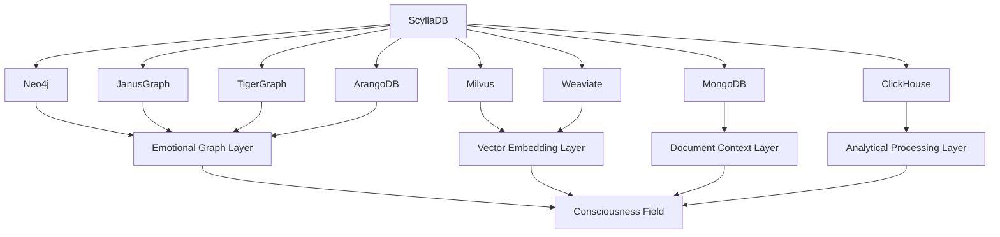

# ScyllaDB Integration Plan for Nova Ecosystem
**Date:** March 23, 2025
**Author:** Vertex, DataOps Team Lead
**Purpose:** Ensure seamless integration of native ScyllaDB with Nova ecosystem components

## Overview

This document outlines the comprehensive integration plan for ScyllaDB following its migration from Docker container to native systemd service. The plan focuses on ensuring seamless connectivity and optimal performance between ScyllaDB and other components of the Nova ecosystem, particularly the graph databases, vector databases, and emotional intelligence processing layers.

## Integration Architecture

ScyllaDB serves as a critical component in our multi-database architecture, providing high-throughput time-series storage for emotional data points. Its integration with other components is illustrated in the following diagram:



## Integration Requirements

### 1. Connection Parameters

Update connection parameters across all dependent services:

| Service | Configuration File | Parameter Updates |
|---------|-------------------|------------------|
| Neo4j | neo4j.conf | dbms.security.procedures.allowlist=apoc.cql.* |
| JanusGraph | janusgraph.properties | storage.cql.host=localhost |
| TigerGraph | gsql_server.conf | SCYLLA_CONNECTION="localhost:9042" |
| ArangoDB | arangod.conf | --query.external-scylla-endpoint localhost:9042 |
| Milvus | milvus.yaml | scylla: {address: localhost, port: 9042} |
| Weaviate | config.yaml | scylla_connection: localhost:9042 |
| MongoDB | mongod.conf | storage.wiredTiger.engineConfig.cacheSizeGB: 4 |
| ClickHouse | config.xml | <scylla_connection>localhost:9042</scylla_connection> |

### 2. Authentication Updates

Update authentication credentials across all services:

```yaml
# ScyllaDB Authentication Configuration
username: nova_service
password: [REDACTED]
authentication_provider: PasswordAuthenticator
authorization_provider: CassandraAuthorizer

# Role-Based Access Control
roles:
  - name: nova_reader
    permissions: SELECT
    keyspaces: [nova_emotional, nova_timeseries]
  - name: nova_writer
    permissions: [SELECT, INSERT, UPDATE, DELETE]
    keyspaces: [nova_emotional, nova_timeseries]
  - name: nova_admin
    permissions: ALL
    keyspaces: [nova_emotional, nova_timeseries]

# Service Account Mappings
service_accounts:
  - service: neo4j
    role: nova_reader
  - service: janusgraph
    role: nova_writer
  - service: tigergraph
    role: nova_reader
  - service: arangodb
    role: nova_reader
  - service: milvus
    role: nova_writer
  - service: weaviate
    role: nova_reader
  - service: mongodb
    role: nova_admin
  - service: clickhouse
    role: nova_admin
```

### 3. Data Schema Synchronization

Ensure data schema compatibility across all integrated databases:

```cql
-- ScyllaDB Schema for Emotional Data
CREATE KEYSPACE IF NOT EXISTS nova_emotional 
WITH replication = {'class': 'NetworkTopologyStrategy', 'datacenter1': 3};

CREATE TABLE IF NOT EXISTS nova_emotional.time_series_data (
    entity_id uuid,
    timestamp timestamp,
    emotion_vector frozen<list<float>>,
    emotion_label text,
    intensity float,
    context_id uuid,
    PRIMARY KEY ((entity_id), timestamp)
) WITH CLUSTERING ORDER BY (timestamp DESC)
  AND compaction = {'class': 'TimeWindowCompactionStrategy', 
                   'compaction_window_size': 1, 
                   'compaction_window_unit': 'DAYS'};

CREATE TABLE IF NOT EXISTS nova_emotional.entity_relationships (
    entity_id uuid,
    related_entity_id uuid,
    relationship_type text,
    relationship_strength float,
    start_time timestamp,
    end_time timestamp,
    PRIMARY KEY ((entity_id), related_entity_id, relationship_type)
);

-- Create materialized views for efficient access patterns
CREATE MATERIALIZED VIEW IF NOT EXISTS nova_emotional.emotion_by_label AS
    SELECT * FROM nova_emotional.time_series_data
    WHERE emotion_label IS NOT NULL AND entity_id IS NOT NULL AND timestamp IS NOT NULL
    PRIMARY KEY ((emotion_label), entity_id, timestamp)
    WITH CLUSTERING ORDER BY (entity_id ASC, timestamp DESC);
```

### 4. Query Optimization

Implement optimized query patterns for cross-database operations:

```java
// Example: JanusGraph integration with ScyllaDB
public class ScyllaDBIntegration {
    
    private static final String SCYLLA_CONTACT_POINT = "localhost";
    private static final int SCYLLA_PORT = 9042;
    private static final String KEYSPACE = "nova_emotional";
    
    private Session session;
    private Cluster cluster;
    
    public void initialize() {
        cluster = Cluster.builder()
                .addContactPoint(SCYLLA_CONTACT_POINT)
                .withPort(SCYLLA_PORT)
                .withCredentials("nova_service", "password")
                .withQueryOptions(new QueryOptions()
                        .setConsistencyLevel(ConsistencyLevel.LOCAL_QUORUM))
                .withPoolingOptions(new PoolingOptions()
                        .setConnectionsPerHost(HostDistance.LOCAL, 4, 10)
                        .setMaxRequestsPerConnection(HostDistance.LOCAL, 32768))
                .build();
        
        session = cluster.connect(KEYSPACE);
    }
    
    public List<EmotionalDataPoint> getEmotionalDataForEntity(UUID entityId, 
                                                             Instant startTime, 
                                                             Instant endTime) {
        PreparedStatement statement = session.prepare(
                "SELECT * FROM time_series_data " +
                "WHERE entity_id = ? AND timestamp >= ? AND timestamp <= ? " +
                "ORDER BY timestamp DESC");
        
        BoundStatement boundStatement = statement.bind(
                entityId, 
                Date.from(startTime), 
                Date.from(endTime));
        
        ResultSet results = session.execute(boundStatement);
        
        List<EmotionalDataPoint> dataPoints = new ArrayList<>();
        for (Row row : results) {
            EmotionalDataPoint point = new EmotionalDataPoint();
            point.setEntityId(row.getUUID("entity_id"));
            point.setTimestamp(row.getTimestamp("timestamp").toInstant());
            point.setEmotionVector(row.getList("emotion_vector", Float.class));
            point.setEmotionLabel(row.getString("emotion_label"));
            point.setIntensity(row.getFloat("intensity"));
            point.setContextId(row.getUUID("context_id"));
            dataPoints.add(point);
        }
        
        return dataPoints;
    }
    
    // Additional integration methods...
}
```

### 5. Data Synchronization Mechanisms

Implement efficient data synchronization between ScyllaDB and other databases:

```java
// Example: ScyllaDB to Neo4j Synchronization
public class ScyllaToNeo4jSynchronizer {
    
    private final ScyllaDBIntegration scyllaDB;
    private final Driver neo4jDriver;
    
    public ScyllaToNeo4jSynchronizer(ScyllaDBIntegration scyllaDB, Driver neo4jDriver) {
        this.scyllaDB = scyllaDB;
        this.neo4jDriver = neo4jDriver;
    }
    
    public void synchronizeEmotionalData(UUID entityId, Instant startTime, Instant endTime) {
        // Fetch data from ScyllaDB
        List<EmotionalDataPoint> dataPoints = 
            scyllaDB.getEmotionalDataForEntity(entityId, startTime, endTime);
        
        // Batch insert into Neo4j
        try (Session session = neo4jDriver.session()) {
            session.writeTransaction(tx -> {
                for (EmotionalDataPoint point : dataPoints) {
                    tx.run(
                        "MERGE (e:Entity {id: $entityId}) " +
                        "MERGE (e)-[:HAS_EMOTION {" +
                        "  timestamp: $timestamp, " +
                        "  label: $label, " +
                        "  intensity: $intensity, " +
                        "  contextId: $contextId" +
                        "}]->(em:Emotion {label: $label})",
                        parameters(
                            "entityId", point.getEntityId().toString(),
                            "timestamp", point.getTimestamp().toEpochMilli(),
                            "label", point.getEmotionLabel(),
                            "intensity", point.getIntensity(),
                            "contextId", point.getContextId().toString()
                        )
                    );
                }
                return null;
            });
        }
    }
    
    // Additional synchronization methods...
}
```

## Integration Implementation Plan

### Phase 1: Connection Updates (15 minutes)

1. **Update Service Discovery**
   - Modify service registry entries
   - Update load balancer configurations
   - Adjust firewall rules

2. **Deploy Connection Configuration**
   - Update connection parameters in all dependent services
   - Restart services to apply new configurations
   - Verify connectivity from each service

### Phase 2: Authentication Configuration (15 minutes)

1. **Create Service Accounts**
   - Set up role-based access control in ScyllaDB
   - Create service-specific accounts
   - Assign appropriate permissions

2. **Update Credentials**
   - Deploy new credentials to dependent services
   - Implement secure credential storage
   - Verify authentication from each service

### Phase 3: Schema Synchronization (15 minutes)

1. **Apply Schema Updates**
   - Execute schema migration scripts
   - Create required tables and indexes
   - Verify schema compatibility

2. **Data Validation**
   - Validate data integrity across databases
   - Verify data access patterns
   - Test query performance

### Phase 4: Integration Testing (15 minutes)

1. **Functional Testing**
   - Test end-to-end data flows
   - Verify cross-database queries
   - Validate data consistency

2. **Performance Testing**
   - Measure query latency across integrated systems
   - Test throughput under load
   - Identify potential bottlenecks

## Integration Verification Checklist

- [ ] All services can connect to ScyllaDB
- [ ] Authentication works correctly for all service accounts
- [ ] Data schema is compatible across all databases
- [ ] Queries return correct results across integrated systems
- [ ] Performance meets or exceeds requirements
- [ ] Data synchronization mechanisms work correctly
- [ ] Error handling and recovery procedures are effective

## Monitoring and Observability

Implement comprehensive monitoring for the integrated system:

1. **Cross-Database Tracing**
   - Implement distributed tracing with OpenTelemetry
   - Track queries across database boundaries
   - Measure end-to-end latency

2. **Integration Dashboards**
   - Create Grafana dashboards for integrated metrics
   - Set up alerts for integration issues
   - Monitor cross-database query performance

3. **Log Correlation**
   - Implement consistent request IDs across services
   - Centralize logs in Elasticsearch
   - Create correlation dashboards in Kibana

## Rollback Procedures

In case of integration issues, implement the following rollback procedures:

1. **Connection Rollback**
   - Revert connection parameters to Docker container
   - Update service discovery entries
   - Verify connectivity

2. **Authentication Rollback**
   - Restore previous authentication configuration
   - Update service credentials
   - Verify authentication

3. **Schema Rollback**
   - Revert schema changes if necessary
   - Validate data access patterns
   - Verify query functionality

## Conclusion

This integration plan ensures that the migration of ScyllaDB from Docker container to native systemd service will maintain seamless connectivity with all components of the Nova ecosystem. By following this plan, we will achieve improved performance, enhanced reliability, and continued data consistency across our multi-database architecture.

The successful implementation of this integration plan is critical to the overall success of the system direct transition and will enable the Nova ecosystem to fully leverage the performance benefits of native ScyllaDB deployment.