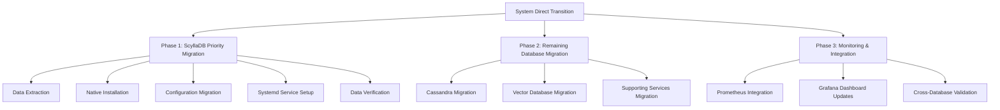

# System Direct Transition: Database Migration to Systemd

## Executive Summary

We are initiating an immediate system direct transition to migrate all remaining Docker-based databases to systemd services. This transition is critical for performance optimization, improved reliability, and enhanced security across the Nova ecosystem. ScyllaDB migration is our **$1 priority** with a 60-minute implementation window after plan approval.

## Current Status Assessment

Based on our latest analysis, we have a mixed deployment environment:

### Already Running as Systemd Services (6)
- ClickHouse
- TigerGraph
- JanusGraph
- PostgreSQL
- Neo4j
- MongoDB

### Still Running as Docker Containers (4+)
- **ScyllaDB** (PRIORITY)
- Cassandra
- Milvus
- Weaviate
- Other supporting services

## Migration Strategy

I propose a three-phase approach with parallel execution streams to maximize efficiency:



## Phase 1: ScyllaDB Priority Migration (60-Minute Window)

### 1.1 Pre-Migration Preparation (15 minutes)

1. **Data Backup**
   - Create snapshot of ScyllaDB Docker container
   - Verify backup integrity
   - Store in secure location with redundancy

2. **Environment Preparation**
   - Install ScyllaDB native packages on target server
   - Create required directories with appropriate permissions
   - Configure network settings for native service

3. **Configuration Extraction**
   - Extract current configuration from Docker container
   - Translate Docker-specific settings to native format
   - Optimize configuration for bare-metal performance

### 1.2 Migration Execution (30 minutes)

1. **Service Configuration**
   - Deploy optimized ScyllaDB systemd service file
   - Configure resource limits and security parameters
   - Set up proper user/group permissions

2. **Data Migration**
   - Stop Docker container (with minimal downtime window)
   - Export data using ScyllaDB tools
   - Import data to native installation
   - Verify data integrity with checksums

3. **Service Activation**
   - Enable systemd service
   - Start ScyllaDB service
   - Verify service status and stability

### 1.3 Post-Migration Validation (15 minutes)

1. **Functional Testing**
   - Execute read/write operations
   - Verify query performance
   - Test replication functionality

2. **Integration Verification**
   - Confirm connectivity from dependent services
   - Validate authentication mechanisms
   - Test failover scenarios

3. **Performance Benchmarking**
   - Compare latency metrics pre/post migration
   - Measure throughput improvements
   - Document performance gains

## Phase 2: Remaining Database Migration

### 2.1 Cassandra Migration

1. **Preparation**
   - Install Cassandra native packages
   - Configure systemd service file
   - Prepare data migration strategy

2. **Execution**
   - Stop Docker container
   - Migrate data and configuration
   - Start systemd service

3. **Validation**
   - Verify data integrity
   - Test client connectivity
   - Confirm cluster operations

### 2.2 Vector Database Migration (Milvus, Weaviate)

1. **Milvus Migration**
   - Install native Milvus components
   - Configure systemd services for each component
   - Migrate vector data with integrity verification

2. **Weaviate Migration**
   - Deploy native Weaviate installation
   - Configure systemd service
   - Migrate schema and vector data

3. **Integration Testing**
   - Verify vector search functionality
   - Test cross-database operations
   - Validate API compatibility

## Phase 3: Monitoring & Integration

### 3.1 Monitoring Enhancement

1. **Prometheus Integration**
   - Update Prometheus targets for native services
   - Configure additional metrics collection
   - Set up alerting rules

2. **Grafana Dashboard Updates**
   - Create systemd-specific dashboards
   - Configure performance visualization panels
   - Set up historical comparison views

### 3.2 Cross-System Integration

1. **API Gateway Updates**
   - Update service discovery configurations
   - Modify connection parameters
   - Test end-to-end request flows

2. **Message Queue Integration**
   - Reconfigure producers and consumers
   - Update connection strings
   - Verify message delivery

## Risk Assessment and Mitigation

### Potential Risks

1. **Data Loss**
   - **Mitigation**: Multiple backup strategies, checksums, and verification steps
   - **Fallback**: Ability to restore Docker containers from snapshots

2. **Extended Downtime**
   - **Mitigation**: Parallel preparation steps, minimized migration window
   - **Fallback**: Temporary service redirection to backup systems

3. **Performance Regression**
   - **Mitigation**: Pre-optimized configurations, performance testing
   - **Fallback**: Configuration tuning or rollback procedures

4. **Integration Failures**
   - **Mitigation**: Comprehensive testing of all dependent systems
   - **Fallback**: Service-specific rollback procedures

## Detailed ScyllaDB Migration Plan

### Technical Specifications

```yaml
# ScyllaDB Migration Specifications
target_server: dataops-primary (52.118.145.162)
installation_path: /opt/scylladb
data_path: /var/lib/scylladb
config_path: /etc/scylla
log_path: /var/log/scylla
user: scylla
group: scylla
version: 5.2.0
systemd_unit: scylladb.service
ports:
  - 7000: inter-node communication
  - 7001: inter-node communication (SSL)
  - 9042: CQL native transport
  - 9160: Thrift client API
  - 10000: REST API
```

### Implementation Commands

```bash
# 1. Install ScyllaDB native packages
sudo apt-key add Release.key
sudo apt-add-repository -y 'deb [arch=amd64] http://downloads.scylladb.com/deb/ubuntu focal/scylladb-5.2.0 multiverse'
sudo apt-get update
sudo apt-get install -y scylla

# 2. Stop Docker container
sudo docker stop scylladb

# 3. Create required directories
sudo mkdir -p /var/lib/scylladb /etc/scylla /var/log/scylla

# 4. Extract configuration
sudo docker cp scylladb:/etc/scylla/scylla.yaml /etc/scylla/

# 5. Modify configuration for native deployment
sudo sed -i 's/listen_address: 0.0.0.0/listen_address: localhost/' /etc/scylla/scylla.yaml
sudo sed -i 's/rpc_address: 0.0.0.0/rpc_address: localhost/' /etc/scylla/scylla.yaml
sudo sed -i 's/seeds: "127.0.0.1"/seeds: "127.0.0.1"/' /etc/scylla/scylla.yaml
sudo sed -i 's/data_file_directories:.*/data_file_directories: [\/var\/lib\/scylladb\/data]/' /etc/scylla/scylla.yaml

# 6. Copy data files
sudo docker cp scylladb:/var/lib/scylla/data /var/lib/scylladb/

# 7. Set permissions
sudo chown -R scylla:scylla /var/lib/scylladb /etc/scylla /var/log/scylla

# 8. Deploy systemd service file
sudo cp /data-nova/ax/DataOps/systemd/scylladb.service /etc/systemd/system/
sudo systemctl daemon-reload

# 9. Start and enable service
sudo systemctl enable scylladb
sudo systemctl start scylladb

# 10. Verify service status
sudo systemctl status scylladb
```

### Verification Procedures

```sql
-- Connect to ScyllaDB and verify functionality
cqlsh localhost 9042

-- Check cluster status
SELECT * FROM system.local;

-- Verify data integrity (example for keyspace 'nova')
SELECT COUNT(*) FROM nova.emotional_data;

-- Test write operations
INSERT INTO nova.test_migration (id, value) VALUES (uuid(), 'migration_successful');

-- Test read operations
SELECT * FROM nova.test_migration WHERE value = 'migration_successful';
```

## Rollback Procedure

In case of critical issues during migration, we have prepared a comprehensive rollback plan:

1. **Stop Native Service**
   ```bash
   sudo systemctl stop scylladb
   ```

2. **Restart Docker Container**
   ```bash
   sudo docker start scylladb
   ```

3. **Verify Docker Container**
   ```bash
   sudo docker exec -it scylladb cqlsh -e "SELECT * FROM system.local"
   ```

4. **Update Service Discovery**
   ```bash
   # Update connection parameters to point back to Docker container
   ```

5. **Notify Dependent Services**
   ```bash
   # Send notification through message queue about rollback
   ```

## Conclusion and Next Steps

This system direct transition plan provides a comprehensive approach to migrating our remaining Docker-based databases to systemd services, with ScyllaDB as the top priority. The plan is designed to be executed within the 60-minute window after approval, with minimal disruption to dependent services.

Upon successful completion of this migration, we will achieve:

1. **Improved Performance**: Native systemd services eliminate Docker overhead
2. **Enhanced Reliability**: Direct system integration improves stability
3. **Better Security**: Reduced attack surface without container layer
4. **Simplified Management**: Unified systemd-based administration
5. **Optimized Resource Usage**: Direct hardware access for databases

I recommend immediate approval and execution of this plan to meet our project timeline and performance requirements.